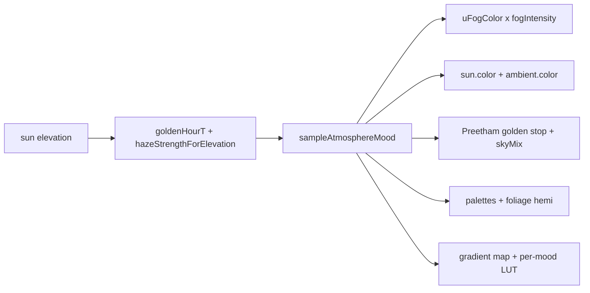

# Firewatch-style atmosphere mood

Supersedes [.cursor/plans/atmosphere_mood_vibe_5700bdb3.plan.md](.cursor/plans/atmosphere_mood_vibe_5700bdb3.plan.md). That plan's diagnosis was verified accurate against live code and its architecture (one mood sample, map-ready hook) is kept. Four things changed: Phases 1 and 2 merge, lights own hue instead of palettes, a value/contrast lever is added, and the display stack (tonemap + LUT) is treated as part of the look rather than a fixed given.

## The correction that matters most

The references are not hue-unification. They are a **narrow hue band plus a very wide value range**: near-black silhouettes against luminous haze. In the misty-daylight reference the near grass is the most saturated thing in frame while the distance goes near-white.

So the rule for every phase below:

- **Collapse hue spread, not saturation.** Kill teal shadows and blue snow; keep near-field chroma high.
- **Fog must be brighter than what it replaces.** A luminous veil, not a tinted film over everything.
- **Push the value split.** Lower `uShadowFloor` per receiver so near geometry silhouettes.

Tinting everything one hue without this gives a sepia filter.




## The display stack is part of the problem

`pipelineComposite.ts` line 55 hardcodes `agxToneMapping(bloomed, uExposure)`. Three.js implements AgX **Base**, not Punchy — `agxDefaultContrastApprox` has no post-curve saturation boost — so the punch in the current look is coming from Elite Chrome at strength `0.8`, not the tonemapper.

> **Resolved in Phase 0.** Punchy now exists in-repo as [src/rendering/postfx/agxPunchyTsl.ts](src/rendering/postfx/agxPunchyTsl.ts) — a port of three's AgX with an ASC CDL + saturation look between the sigmoid and the outset matrix, driven by live uniforms (`VISUAL.render.agxLook`). It was chosen over Neutral. Read the analysis below as the case *against* AgX base, which Punchy's saturation term partly answers; the path-to-white critique still stands and constrains `fogIntensity` (see Phase 1).

AgX is engineered to prevent exactly what these references need. Reading `node_modules/three/src/nodes/display/ToneMappingFunctions.js` lines 166-195:

- `AgXInsetMatrix` rows are `(0.857, 0.137, 0.112)` and similar — each output channel absorbs 10-14% of the others, a deliberate chroma reduction before the curve.
- `AgxMinEv -12.47` to `AgxMaxEv 4.026` compresses 16.5 stops into 0..1, flattening the value split.
- The per-channel log sigmoid is the "path to white" — the brighter a color, the more it desaturates.

The reference skies are bright **and** saturated simultaneously. This also breaks the `fogIntensity` lever below: under AgX, raising fog intensity makes the haze whiter rather than more orange, so the two levers cancel.

`neutralToneMapping` (Khronos PBR Neutral, same file lines 208-242) is the opposite: `StartCompression = 0.76` means everything below that peak passes through untouched — no matrices, no hue rotation — with a gentle `Desaturation = 0.15` rolloff above. An authored hex reaches the screen as that hex, which is what a mood system needs. Its cost is no filmic toe, so shadow contrast moves into the procedural grade where it is per-stop tunable anyway.

---

## Phase 0 - DEV tonemap picker

Cheap, and it makes the rest a taste call instead of a guess.

- `three/tsl` exports `linearToneMapping`, `reinhardToneMapping`, `cineonToneMapping`, `acesFilmicToneMapping`, `agxToneMapping`, `neutralToneMapping` — all the same `(color, exposure)` signature, so this is a swap at [src/rendering/postfx/pipelineComposite.ts](src/rendering/postfx/pipelineComposite.ts) line 55.
- `createPipelineComposite` already builds four composite variants keyed on godrays/bloom. Rather than multiply that by six tonemappers, read the mode from a module-level DEV setting and reload on change — consistent with the project's existing "full page reload after shader graph changes" convention.
- Surface it in **Sky and atmosphere**, whose hint text currently hardcodes "Tonemap: AgX" ([src/dev/panel/devPanelSky.ts](src/dev/panel/devPanelSky.ts) line 42).
- Expect exposure to be wrong on every non-AgX option until Phase 1 retunes it. Judge hue and saturation behaviour, not brightness.

**Done when:** you can reload into Neutral / ACES / AgX and compare the same golden-hour frame. Recommendation stands at Neutral unless ACES reads better with the mood colors in.

**Outcome:** picker shipped with six options plus AgX Punchy; grade and LUT defaulted off so the A/B read the raw composite. Winner is **AgX Punchy** at slope 1, power 1.25, saturation 1.3 — now the shipped `VISUAL.render.toneMap`. Two consequences for Phase 1:

- **Exposure and bloom retune mostly evaporates.** Punchy shares AgX's 16.5-stop window, so `VISUAL.sky.exposureCurve` and `VISUAL.bloom` stay approximately valid. Only power 1.25 shifts mids slightly. This was costed against a Neutral swap and no longer applies.
- `**fogIntensity` stays a weak lever.** Saturation 1.3 claws back midtone chroma but does not defeat the path to white, so raising fog intensity still pales the haze near the top of the range. Author fog hue more saturated than looks right in isolation, and expect the Phase 3 gradient map to carry more of the load than originally scoped.

---

## Architecture

Mood set lives next to the haze numbers in [src/config/visual/atmosphere.ts](src/config/visual/atmosphere.ts), sampled once per frame in [src/rendering/atmosphere/atmosphereCycle.ts](src/rendering/atmosphere/atmosphereCycle.ts) using the existing clocks.

```ts
interface AtmosphereMoodStop {
  fog: string;           // aerial + slab + sky horizon
  fogIntensity: number;  // linear scale applied BEFORE the tonemap (see Gap B)
  skyMix: number;        // dome mix ceiling toward fog, 0..1
  sun: string;           // DirectionalLight.color + shader uSunColor
  ambient: string;       // AmbientLight.color + foliage sky hemi
  shadow: string;        // foliage ground hemi + gradient-map dark stop
  highlight: string;     // gradient-map bright stop (Phase 3)
  shadowFloor: number;   // value split - lower = darker silhouettes
  lut: { path: string; strength: number };  // per-stop film finish (Phase 3)
}

interface AtmosphereMoodSet { night; golden; noon: AtmosphereMoodStop }
```

Blend: noon to golden by `goldenHourT`, then that result to night by `hazeStrengthForElevation`. Same envelope as fog today, so nothing can drift.

Map hook (seam only, no schema): `getActiveMoodSet()` / `setAtmosphereMoodOverride(set | null)`. Play uses `VISUAL.atmosphere.moods.default`; a later map key can swap the whole set at load with no shader change.

Art brief for the starting hues: night indigo fog and ambient with cool-steel sun; golden saturated orange fog, amber sun, sienna ambient; noon pale luminous warm-cream fog with pale-gold sun and muted olive ambient. `fogIntensity` should be at or above 1 at noon and golden so the haze reads as light, not a filter.

---

## Phase 1 - Mood sample, fog, lights, sky

Merged because fog alone at noon would sit against an unchanged blue Preetham dome, a white sun, and a cool `#c8d8f0` foliage hemi.

**Mood + fog**

- Add `AtmosphereMoodSet` to [src/config/visual/atmosphere.ts](src/config/visual/atmosphere.ts); `haze.dayColor` / `nightColor` retire into `moods.default`.
- `sampleAtmosphereMood(elevationDeg)` replaces `sampleHazeTint` in [src/rendering/atmosphere/atmosphereCycle.ts](src/rendering/atmosphere/atmosphereCycle.ts). It needs `goldenHourT` from `lightingCurves` - the same cross-import `syncTerrainSplatLighting` and `cloudColorTsl` already use, and `lightingCurves`'s `SkySystem` import is type-only, so no runtime cycle.
- `setValleyFogFromSun` in [src/rendering/atmosphere/atmosphereSystem.ts](src/rendering/atmosphere/atmosphereSystem.ts) writes `mood.fog` scaled by `mood.fogIntensity` into `uFogColor`.
- Update `setValleyFogEditorPreview`, which currently reads `fogParams.nightColor` directly.
- Retune aerial for thicker near-mid air: today `aerialStartM: 200` to `aerialEndM: 560` at `0.75`. Pull start inward, but watch that the nearest geometry stays a silhouette rather than washing out.

**Gap B - fog color is pre-tonemap.** `scene.fogNode = fog(color(uFogColor), fogArea)` sits in linear working space before the tonemap, while the sky has its own `uSkyExposure` and terrain scales by `sunColor x sunIntensity`. A fixed sRGB hex holds fixed luminance while everything else moves with exposure, so noon reads as dark sludge. `fogIntensity` (optionally keyed off `sampleLighting().globalExposure`) is the fix — and it only behaves as intended under a hue-faithful tonemapper, since AgX turns extra intensity into white rather than saturated hue.

**Exposure and bloom retune.** Bake the Phase 0 winner into `pipelineComposite.ts`, then retune `VISUAL.sky.exposureCurve` (`groundLow` / `groundHigh` / `skyLow` / `skyHigh` in [src/config/visual/sky.ts](src/config/visual/sky.ts)) — the current values are fitted to AgX's 16.5-stop window and will read very differently under Neutral's near-linear range. Bloom is added **before** the tonemap at `pipelineComposite.ts` line 53, so `VISUAL.bloom` strengths need the same pass; under Neutral, bloom above ~1.0 clips to white far sooner than under AgX. God rays are added pre-tonemap too (line 37).

**Lights**

- Write `sun.color` and `ambientLight.color` from mood inside `applyWorldLightingFromElevation` ([src/rendering/sky/lightingCurves.ts](src/rendering/sky/lightingCurves.ts)). Verified correct hook: it runs via `dayCycle.update` at [src/core/gameTick.ts](src/core/gameTick.ts) line 123, before `syncWorldLighting` at line 131, so `syncTerrainSplatLighting` picks up the new colors the same frame with no lag.
- Also lower `uShadowFloor` from `mood.shadowFloor` via [src/rendering/sunShadow/receiverUniforms.ts](src/rendering/sunShadow/receiverUniforms.ts) - this is the value-split lever.

**Sky**

- Add a golden Preetham stop (higher turbidity and mie, lower rayleigh) to [src/rendering/sky/skyRevealBlend.ts](src/rendering/sky/skyRevealBlend.ts), blended by `goldenHourT` on top of the existing night-to-day blend.
- **Gap C - decouple the dome mix.** [src/rendering/atmosphere/skyHorizonHazeTsl.ts](src/rendering/atmosphere/skyHorizonHazeTsl.ts) currently computes `daySeam = band.mul(aerialStrength)`, so the dome can never exceed 75% fog color, and `skyHorizonEnd: 0.36` only covers the bottom third. The Firewatch reference has the fog hue owning roughly 90% of the dome. Add a `skyMix` strength parameter separate from ground aerial and raise `skyHorizonEnd`. Signature change - update both call sites: [src/rendering/sky/SkySystem.ts](src/rendering/sky/SkySystem.ts) line 125 and [src/rendering/sky/hdri/nightHdriBackgroundTsl.ts](src/rendering/sky/hdri/nightHdriBackgroundTsl.ts) line 74.
- God rays: `TINT_R/G/B` in [src/config/visual/godrays.ts](src/config/visual/godrays.ts) are gain multipliers around 1.0 (`1.05 / 0.92 / 0.72`), not an absolute color. Derive them from `mood.sun` **normalized to preserve current luma**, or shaft brightness swings with hue.

**Dev**

Distance haze panel ([src/dev/panel/devPanelHaze.ts](src/dev/panel/devPanelHaze.ts)): the two tint pickers become Noon / Golden / Night stops with `fogIntensity` and `skyMix` sliders, plus a live blended-hex readout next to the existing clock row.

**Done when:** scrubbing the day cycle, fog, dome, sun disc, and god rays share one hue per hour; the haze reads as light rather than a film; near trees stay dark against it. Constraint from the existing panel still holds - night fog tint must stay lighter than unlit terrain or the valley pool disappears.

Full page reload after the sky and horizon-haze graph edits.

### Outcome

Landed: mood set + `sampleAtmosphereMood` + map hook; fog tint and `fogIntensity`; aerial start pulled to 120 m; `skyMix` on the stops driving a `uSkyMix` uniform decoupled from `uAerialStrength` with `skyHorizonEnd` raised 0.36 → 0.72; a golden Preetham stop (`VISUAL.sky.golden`, turbidity 16 / rayleigh 0.8 / mie 0.012 / G 0.82) blended by `goldenHourT`; `sun.color` and `ambientLight.color` from the mood; god-ray tint from `mood.sun`; haze panel with all four color channels per stop plus intensity and sky-mix rows.

Two structural notes for later work:

- `applyWorldLightingFromElevation` moved out of `lightingCurves.ts` into `rendering/sky/applyWorldLighting.ts`. `atmosphereCycle` imports `goldenHourT` from `lightingCurves`, so sampling the mood there would have closed a runtime import cycle. `lightingCurves` is now pure elevation→numbers; anything that writes to lights or materials goes in the new module.
- `mood.shadowFloor` is wired as a **base × multiplier** (see `phase-1b-shadowfloor`). Each receiver keeps a base floor (VISUAL defaults / DEV Shadows sliders); the blended mood mul scales all four uniforms — including terrain, which lives outside `syncSunShadowReceivers`. Perf Disable shadows still forces floors to 1 without wiping bases.

Exposure and bloom were left alone — Punchy stayed inside AgX's stop range (see Phase 0 outcome).

### Phase 1b outcome

Landed: `AtmosphereMoodStop.shadowFloor` (noon 1 / golden 0.7 / night 0.9) blended in `sampleAtmosphereMood`; `sunShadowDebugTargets` stores per-receiver **bases** and applies `clamp(base × moodMul)`; DEV Shadows sliders read/write bases; `setMoodShadowFloorMul` from `applyWorldLightingFromElevation`; `bindSunShadowFloorTargets` at play boot covers terrain+grass+props+water; Disable shadows forces effective 1 and re-enable reapplies bases × mul (no VISUAL wipe). Haze panel has per-stop shadow-floor × sliders.

---

## Phase 2 - Ground materials

Lights own hue now, so palettes **flatten** rather than push further gold. This is the Gap D fix: terrain diffuse is `mix(albedo, palette, paletteMix) x ao x (ambientColor x ambI + sunColor x sunI)` in [src/world/terrain/tsl/terrainStylizeLightingTsl.ts](src/world/terrain/tsl/terrainStylizeLightingTsl.ts), so orange lights times orange palettes is neon.

Retune `stylize` in [src/config/visual/terrain.ts](src/config/visual/terrain.ts):

- Narrow the hue spread, keep saturation. Worst offenders: `snow.noon.shadow: '#8aa0b8'` (blue), `meadow.noon.sun: '#DDEE42'`, and `global.shadow: '#03353D'` - a dark teal pushed globally at `globalPaletteMix: 0.25`, which the old plan did not name.
- Golden stops move toward neutral-in-family, not further orange - the sun color now carries that.

Foliage:

- Drive `uSkyTint` from `mood.ambient` and `uGroundTint` from `mood.shadow` each frame. Both grass ([src/world/grass/config/grassUniforms.ts](src/world/grass/config/grassUniforms.ts)) and props ([src/world/mapProps/config/mapPropShadowUniforms.ts](src/world/mapProps/config/mapPropShadowUniforms.ts)) already expose these as live uniforms, so this is a `.value` write with no rebuild. Cleanest writer is [src/rendering/sunShadow/syncSunShadowReceivers.ts](src/rendering/sunShadow/syncSunShadowReceivers.ts). Note prop `uGroundTint` is double-purposed and also tints ground contact in [src/world/mapProps/tsl/propGroundContactTsl.ts](src/world/mapProps/tsl/propGroundContactTsl.ts).
- **Props have no `uSunColor` at all** - `propSunReceiverUniforms` carries intensity, direction, daylight, player glow only. So mood can currently tint prop ambient but not their sun-lit faces, yet sunlit trunks are the most orange element in the Firewatch reference. Add `uSunColor` to `propSunReceiverUniforms`, `mapPropShadowUniforms`, and the wrap term in [src/world/mapProps/tsl/mapPropShadingTsl.ts](src/world/mapProps/tsl/mapPropShadingTsl.ts). Grass already has one via `grassSunReceiverUniforms`.

Clouds: sample `mood.sun` / `mood.ambient` in [src/rendering/clouds/cloudColorTsl.ts](src/rendering/clouds/cloudColorTsl.ts) rather than maintaining a second 4-stop `PALETTE` - `midday.ambient: 0xb0c4de` and `lowSun.ambient: 0x667799` are both cool. Keep `applyCloudWorldLightScale` as-is; it is the value lever for clouds.

Water: shift day/night colors in [src/config/visual/water.ts](src/config/visual/water.ts) toward the mood, keeping the shore fog bypass so foam stays readable.

**Done when:** trees, grass, snow, and water sit inside the fog's hue family at all three stops, without near-field saturation dropping.

### Outcome

Landed: terrain stylize flattened (no teal global shadow, no blue snow, no lime meadow; golden stops neutral-in-family); shared mood hemi uniforms on `grassSunReceiverUniforms` (`uSkyTint` ← ambient, `uGroundTint` ← shadow) aliased by grass + props; `uSunColor` on props with N·L wrap tint in `mapPropShadingTsl`; clouds sample mood instead of the cool 4-stop palette (`goldenTintStrength` still lifts albedo toward mood sun); water day/night toward warm olive / indigo. Grass DEV sky/ground tint pickers removed (mood owns them). Full page reload after prop shading graph change.

---

## Phase 3 - Grade: gradient map + per-mood LUT

**Gradient map instead of a hue crush.** The earlier plan's "mix chroma toward `mood.fog`" only flattens value, which undoes Phase 1. The standard technique for single-hue stylized atmosphere is a luminance-to-ramp map: take scene luma and lerp `mood.shadow` to a mid color to `mood.highlight`, then blend that toward the original at a strength so albedo detail survives.

It does both jobs at once — unifies hue *and* gives explicit authored control over the value curve — and it is two lerps on luma with no texture. It also makes the ice-cave reference free: a cyan mood set carries its own ramp with no shader change.

- Add it in [src/rendering/postfx/postGrade.ts](src/rendering/postfx/postGrade.ts) alongside `applyProceduralGrade`, after contrast/saturation and before the LUT.
- Note the existing warmth term is `mix(lifted, lifted.mul(tint), warmth)` — a multiply that darkens as it tints. The ramp replaces it rather than stacking on it; with a gradient map, a separate warmth multiply is double-tinting.
- Non-zero strength at noon so midday is still a painting. If it looks neon, lower ramp strength before touching fog saturation.

**Per-mood LUT.** Today [src/rendering/postfx/postGrade.ts](src/rendering/postfx/postGrade.ts) holds one `lutTextureNode` plus `uLutStrength` / `uLutSize`, swapped at runtime via `setPostGradeLutTexture` and `setGradeLut` in [src/rendering/postfx/controls/gradeControls.ts](src/rendering/postfx/controls/gradeControls.ts). To let noon / golden / night each pick their own:

- Three texture slots sampled and blended with the same two-stage mood lerp (`goldenHourT`, then `hazeStrengthForElevation`). `sampleLutStrip2D` is 2 samples per LUT, so 6 total in one fullscreen pass — negligible.
- Each slot needs its own `uLutSize`: `.cube` files carry `LUT_3D_SIZE` in the file and `loadGradeLut` returns it per asset, so the three can differ.
- Load all three at boot via `loadGradeLut`. Until a slot resolves, point it at the neighbouring stop rather than the 1x1 gray placeholder from `getPlaceholderLutTexture`, which is not LUT-neutral and would flash.
- Keep Perf **Disable grade** zeroing both procedural and LUT paths, as `applyDebug` does now.
- Simpler fallback if three slots get awkward: pre-blend the three strips on the CPU and upload only when the mood weights move past an epsilon. Weights change slowly, so this is cheap — but it costs a 131 KB texture upload per change at size 32.

Starting point: drop Elite Chrome toward 0 while tuning so the in-engine mood is doing the work, then dial each stop back up. `Golden Light` suits the golden stop and `Moody Film` the night stop. Do not let a LUT invent the hue — if a stop needs a strong LUT to read right, the mood colors are wrong.

**Done when:** Perf's Disable grade still leaves Phases 1 and 2 looking like a painting, and each stop's LUT is a finish rather than the source of its color.

### Outcome

Landed: `highlight` + `gradientStrength` + per-stop `lut` on mood stops; gradient map in `postGrade` (shadow→unscaled fog mid→highlight on luma) replaces the warmth multiply; three LUT strips blended noon→golden→night with per-slot sizes; boot `loadMoodGradeLuts` with neighbour fallback; grade+LUT re-enabled (Elite Chrome 0.2 / Golden Light 0.3 / Moody Film 0.35); DEV picker overrides all slots for A/B, None restores mood strips. Full page reload after grade graph change.

---

## Phase 4 - Night orb punch

Keep orbs and the guide ribbon at `fog = false`. The player point light stays the warm punch against indigo (the torch in the night reference); optionally tint it slightly off pure white in [src/entities/PlayerVisuals.ts](src/entities/PlayerVisuals.ts).

## Out of scope

Volumetric raymarch or an extra fog pass, replacing Preetham with a painted skybox, cave content or map JSON schema (hook only), custom authored `.cube` LUTs (the shipped catalog is enough to finish with).

## Verify (you run play)

Full reload after Phase 0 (tonemap swap), Phase 1 (sky and horizon-haze graphs), and Phase 3 (grade graph). Scrub Sky to Day cycle and A/B each phase:

- **Phase 0** - same golden-hour frame under AgX vs Neutral vs ACES; judge whether saturated bright hues survive, ignoring brightness
- **Night** - one indigo field, distant trees silhouette, orb pool is the only warm exception
- **Golden** - land, dome, fog, and god rays share orange; shadows sienna not gray; near trunks still dark
- **Noon** - analog and luminous, not a rainbow and not a sepia filter; near ground keeps chroma; snow is not blue
- Perf isolates (Disable valley fog / distance haze / grade) still work

Index note: GitNexus is behind HEAD and still names deleted `valleyFog.ts` / `hazeCycleStrength.ts`. Follow the live barrel at [src/rendering/atmosphere/index.ts](src/rendering/atmosphere/index.ts).