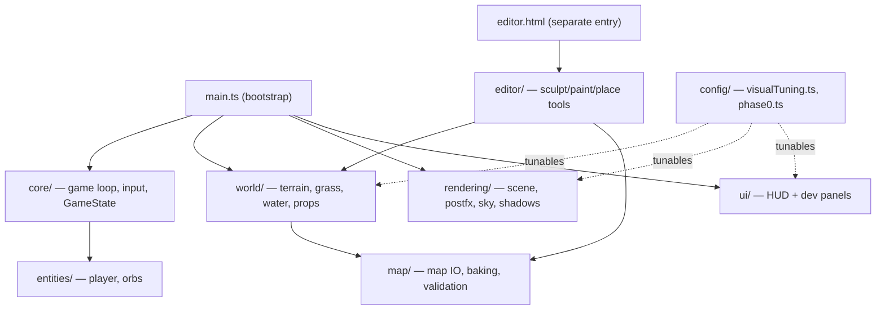

# Pantheon Codebase Overview

Current `src/` totals **~264 files / ~25,100 lines** (post Phase 1-5 cleanup). Broken down by top-level folder:

| Folder       | Files | Lines | Share |
| ------------ | ----- | ----- | ----- |
| `world/`     | 96    | 7,998 | 32%   |
| `ui/`        | 30    | 5,028 | 20%   |
| `rendering/` | 65    | 3,840 | 15%   |
| `editor/`    | 34    | 3,831 | 15%   |
| `map/`       | 14    | 1,653 | 7%    |
| `core/`      | 11    | 986   | 4%    |
| `config/`    | 2     | 702   | 3%    |
| `entities/`  | 6     | 378   | 2%    |
| `main.ts`    | 1     | 341   | 1%    |
| `assets/`    | 2     | 223   | 1%    |
| `dev/`       | 3     | 105   | <1%   |

Non-code: `public/` (~220 MB — glTF models, terrain/water/env textures, LUTs) and `story-mechanics/` (GDD, read-only design docs).

## 1. Core / Game Loop — [src/core/](src/core/) (11 files, 986 lines)

**Purpose:** Fixed-step game loop, input, central mutable `GameState`, energy/reveal state machine, event bus.

**Key files:** [src/core/GameState.ts](src/core/GameState.ts) (336 lines — central state + all dev-settings interfaces), [src/core/gameTick.ts](src/core/gameTick.ts) (per-frame `fixedUpdate`/`render`, extracted from `main.ts` in Phase 2), [src/core/reveal/WorldReveal.ts](src/core/reveal/WorldReveal.ts) + [src/core/reveal/DayCycle.ts](src/core/reveal/DayCycle.ts) (energy-cap reveal, day/night cycle), [src/core/reveal/sunRevealState.ts](src/core/reveal/sunRevealState.ts) (leaf module, Phase 4 cycle fix).

**Deep-dive angles:** `GameState.ts` mixes gameplay state with ~15 dev-panel settings interfaces — candidate to split dev-only state into a separate file behind `import.meta.env.DEV`. `DayCycle.ts` has a known pre-existing `tsc` error (private member access) worth a quick look. 

## 2. Rendering & Post-FX — [src/rendering/](src/rendering/) (65 files, 3,840 lines)

**Purpose:** WebGPU scene setup, camera rig, sun shadows, sky/HDRI, and the full post-FX pipeline (bloom, god rays, DoF, grade, LUT, FXAA).

**Subareas:**

- `postfx/` (24 files, 1,570 lines) — [createPostFxPipeline.ts](src/rendering/postfx/createPostFxPipeline.ts) is still the largest file here at **480 lines** even after the Phase 3 factory-function refactor (4 factories + orchestrator all still live in one file) — natural next step: split `createGodraysControls`/`createBloomControls`/`createDofControls`/`createGradeControls` into their own files.
- `sky/` (10 files, 749 lines) — Preetham sky, HDRI blend, lighting curves, sun cycle.
- `sunShadow/` (9 files, 290 lines) — shadow map sizing, receiver floors; has a known pre-existing `tsc` error (`SunShadowFilterMode` export).
- `debug/`, `atmosphere/`, `tsl/`, `loaders/` — smaller focused helpers.

**Deep-dive angles:** GPU-bound post-FX chain is the highest-leverage area for frame-time optimization (bloom/god-rays/DoF cost, `RenderPipeline` node graph size). Also flagged in the audit: two benign type-only import cycles remain (`PostFX.ts` <-> `createPostFxPipeline.ts`).

## 3. World — Terrain — [src/world/terrain/](src/world/terrain/) (28 files, 2,545 lines)

**Purpose:** Biome-splat terrain (Poly Haven packs → atlases → TSL splat material), play-mode LOD rings (fine center patch + coarse macro base), macro height texture, shadow casters.

**Key files:** [terrainMapAtlas.ts](src/world/terrain/atlas/terrainMapAtlas.ts) (386 lines, atlas packing), [biomeSplatShading.ts](src/world/terrain/material/biomeSplatShading.ts) (298 lines, TSL shading), [MapTerrainBuilder.ts](src/world/MapTerrainBuilder.ts) (336 lines, mesh build orchestration).

**Deep-dive angles:** Vertex displacement + detail-ring `If` branching in TSL shaders is a per-fragment GPU cost worth profiling; atlas rebuild cost on paint-map upload.

## 4. World — Grass — [src/world/grass/](src/world/grass/) (28 files, 2,968 lines)

**Purpose:** GPU-driven 3-LOD-ring grass with SSBO compaction + indirect draw; optional flower field shares compute patterns.

**Key files:** [GrassSystem.ts](src/world/grass/core/GrassSystem.ts) (238 lines, entry point), `compute/*Ssbo.ts` (compaction), `config/grassDevPanelSpecs.ts` (373 lines, just extracted in Phase 5).

**Deep-dive angles:** Compute-shader dispatch cost per ring, `whenComputeReady()` sync point in the render loop (potential frame-time stall), instance count vs. density tuning.

## 5. World — Water — [src/world/water/](src/world/water/) (25 files, 1,345 lines)

**Purpose:** Reflective ocean plane, adaptive reflection resolution, shore depth/foam TSL, tide animation.

**Deep-dive angles:** `updateWaterReflectionQuality.ts` has CRLF/formatting drift (biome flags it) and adaptive-resolution heuristics are a good perf-tuning target (reflector RT resize cost).

## 6. World — Map Props & misc — [src/world/mapProps/](src/world/mapProps/), [src/world/*.ts](src/world/) (14 files, 1,140 lines combined)

**Purpose:** GLTF prop instancing, ground-contact shading, shadow uniforms; plus top-level world orchestration (`WorldBuilder.ts`, `disposeWorldTerrain.ts`).

## 7. Map I/O & Baking — [src/map/](src/map/) (14 files, 1,653 lines)

**Purpose:** Map JSON schema, grids, validation, biome-weight baking for procedural-to-authored terrain data.

**Key file:** [biomeWeightBake.ts](src/map/biomeWeightBake.ts) (558 lines — largest file in the whole repo, but algorithmic/well-factored per the prior audit).

## 8. Entities — [src/entities/](src/entities/) (6 files, 378 lines)

**Purpose:** Player controller, energy orbs. Small, focused — low priority for deep-dive.

## 9. UI — HUD & Dev Panels — [src/ui/](src/ui/) (~35 files, ~5.1k lines)

**Purpose:** Player HUD, FPS counter, and the DEV-only tuning panel system (`import.meta.env.DEV` gated).

**Subareas:** `dev/` (~27 files) — wiring files (`devPanelX.ts`) + declarative specs (`devPanelXSpecs.ts` where extracted). Largest: [devPanelGrass.ts](src/ui/dev/devPanelGrass.ts) + [devPanelGrassSpecs.ts](src/ui/dev/devPanelGrassSpecs.ts).

**Deep-dive:** [ui_hud_dev_panels_audit_a2b13b33.plan.md](.cursor/plans/ui_hud_dev_panels_audit_a2b13b33.plan.md) — Phases A–F (A1–E2 required, F1 optional). Code-quality/dedup focus; production HUD is event-driven (no per-frame DOM).

## 10. Editor — [src/editor/](src/editor/) (34 files, 3,831 lines)

**Purpose:** DEV map editor (separate `editor.html` entry) — sculpt/paint/place tools, asset sidebar, session orchestration.

**Subareas:** `place/` (13 files, 1,460 lines — Single + Brush prop placement), `ui/` (969 lines), `core/` (956 lines, `EditorSession.ts` at 313 lines).

**Deep-dive angles:** Not on the play-mode hot path, so lower perf priority; code-quality/structure review still valuable given its size.

## 11. Config — [src/config/](src/config/) (2 files, 702 lines)

**Purpose:** `visualTuning.ts` (603 lines — single source of truth for all shipped visual tunables) and `phase0.ts` (legacy/gameplay re-exports).

**Deep-dive angle:** Already the biggest single file in the repo; audit previously found this acceptable (flat config object, not logic-heavy), but worth confirming no dead tunables remain.

## 12. Assets & Dev-only debug — [src/assets/](src/assets/), [src/dev/](src/dev/)

**Purpose:** Asset manifest/catalog (`assetManifest.ts`) and small DEV-only render-debug controllers. Low line count, low priority.

## Suggested next steps

The todos below are candidate deep-dive sessions, roughly ordered by likely impact (performance first, then quality). Pick one (or more) to continue into.