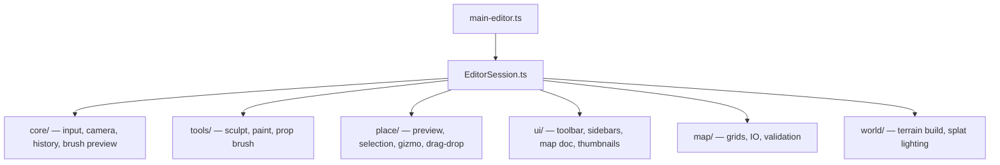

# Editor — Deep Dive Audit & Implementation Plan

**Scope:** [src/editor/](src/editor/) — 34 files, ~3,831 lines. DEV-only map editor (`editor.html` → [main-editor.ts](src/editor/main-editor.ts)). Not on play-mode hot path; focus is correctness, maintainability, and obvious waste.

**Goal:** Leaner, more performant editor code — collapse duplication, fix bugs, avoid new helpers unless clearly warranted.

**Parent overview:** Section 10 in [codebase_section_overview_f42eaa7c.plan.md](.cursor/plans/codebase_section_overview_f42eaa7c.plan.md).



---

## Re-verification summary (2026-07-03)

Spot-checked all high-severity findings against **current codebase** + **GitNexus** after terrain audit (notably **B2**: `syncTerrainSplatLighting` now uses `sunDirectionFromSpherical(currentSunElevationDeg(), currentSunAzimuthDeg())`).

| Finding | Status | Notes |
|---------|--------|-------|
| **A1** Editor sun vs terrain TSL | **Valid — still broken** | [EditorSession.ts:268](src/editor/core/EditorSession.ts) calls `syncTerrainSplatLighting`; [syncTerrainSplatLighting.ts:37](src/world/terrain/material/syncTerrainSplatLighting.ts) reads play-mode `sunRevealState` (not updated in editor). Scene sun is fixed at [EditorSession.ts:59](src/editor/core/EditorSession.ts). GitNexus `impact(syncTerrainSplatLighting, upstream)`: **HIGH**, 2 direct callers (`EditorSession`, play `gameTick`). Run impact before edit. |
| **A2** Stale selection after undo | **Valid** | `applySnapshot` clears gizmo only ([EditorSession.ts:131](src/editor/core/EditorSession.ts)). `clearSelection()` exists **internally** in [EntitySelectionController.ts:87](src/editor/place/EntitySelectionController.ts) but is **not on public context API**. |
| **A3** Stale selection after rebind | **Valid** | [EditorPlaceMode.ts:104](src/editor/place/EditorPlaceMode.ts) reloads entities with new UIDs; no selection clear. |
| **A4** Preview GPU leaks | **Valid** | [mapEntityPreviewMeshes.ts:185](src/editor/place/mapEntityPreviewMeshes.ts) `remove` without dispose; highlights/thumbnails same pattern. |
| **A6** Marquee terrain block | **Valid** | `blockTerrainPointer()` at [EntitySelectionController.ts:164](src/editor/place/EntitySelectionController.ts); `hideMarquee` does not clear. Next terrain `pointerdown` consumes block via [EditorInput.ts:50](src/editor/core/EditorInput.ts) — swallows one brush click. |
| **A8** Incomplete dispose | **Valid** | [EditorSession.ts:349](src/editor/core/EditorSession.ts) missing `editorCam`, `input`, `editorPlayerLight`, `disposeAssetThumbnails` (thumbnails only in [main-editor.ts:53](src/editor/main-editor.ts) `beforeunload`). |
| **A9** Stroke undo on tool switch | **Valid** | [EditorSession.ts:300-302](src/editor/core/EditorSession.ts) discards `strokeBefore` without `commitGesture`. |
| **A10** Paint radius mismatch | **Valid — paint only** | Slider `value="12"` [EditorUI.ts:72](src/editor/ui/EditorUI.ts); `PaintBiomeTool` default `radius: 10` [PaintBiomeTool.ts:35](src/editor/tools/PaintBiomeTool.ts). Sculpt default `12` matches slider. |
| **B2** Double GLTF clone | **Valid** | [mapEntityPreviewMeshes.ts:71-72](src/editor/place/mapEntityPreviewMeshes.ts) |
| **F5 / F10** Camera docs wrong | **Valid** | [EditorCamera.ts:29](src/editor/core/EditorCamera.ts) code: RMB=rotate, Space+LMB=pan. Comments + [EditorUI.ts TOOL_HINTS](src/editor/ui/EditorUI.ts) say the opposite. |
| **C1** Sculpt/paint dedup | **Valid** | Same debounce/flush/`wasPointerDown` skeleton in both tools. |
| **B5, B6, F8** | **Deferred (OOS)** | Dirty-region undo rebuild, thumbnail encode batching, stroke FSM collapse — optional; skip unless requested. |

**GitNexus:** Index **1 commit stale** — run `node .gitnexus/run.cjs analyze` before Batch 3 (A1 touches `syncTerrainSplatLighting`).

**Out of scope (confirmed):** Play-mode post-FX in editor, GPU instancing for editor previews (picking requires clones), new shared DOM helper modules beyond adopting existing `bindRange`/`bindCheckbox`.

---

## Phased task list

### Phase A — Bugs / correctness

| ID | Task | Files | Risk |
|----|------|-------|------|
| **A1** | Editor terrain lighting: pass fixed editor sun direction into `syncTerrainSplatLighting` (optional `sunDirection?: Vector3` param — when set, skip `sunRevealState` lookup). Editor derives dir from scene `sun.position`. | `syncTerrainSplatLighting.ts`, `EditorSession.ts` | **HIGH** (GitNexus) |
| **A2** | Expose `clearSelection()` on `EntitySelectionContext`; call from `applySnapshot` after undo/redo. | `EntitySelectionController.ts`, `EditorSession.ts` | LOW |
| **A3** | Clear selection in `EditorPlaceMode.rebind` and `reloadMap`. | `EditorPlaceMode.ts`, `EditorSession.ts` | LOW |
| **A4** | Dispose GLTF clone geometry/material on preview remove; dispose `BoxHelper` + `PointLight` in highlights; dispose thumbnail clones after encode. | `mapEntityPreviewMeshes.ts`, `mapEntityPreviewHighlights.ts`, `EditorAssetThumbnails.ts` | LOW |
| **A5** | `reconcileEntities`: if `key`/`type` changed → remove+add (re-clone), not transform-only. | `MapEntityPreview.ts`, `reconcileEntityPreview.ts` | LOW |
| **A6** | `consumeTerrainPointerBlock()` or explicit clear in `hideMarquee` / `finishMarquee`. | `EntitySelectionController.ts` | LOW |
| **A7** | `isFormFieldTarget` guard on Delete/Backspace (reuse pattern from `EditorHistory.ts`). | `EntitySelectionController.ts` | LOW |
| **A8** | Complete `EditorSession.dispose()`: `editorCam.dispose()`, `input.dispose()`, remove `editorPlayerLight`, `disposeAssetThumbnails()`. | `EditorSession.ts` | LOW |
| **A9** | On tool switch while pointer down: `commitGesture(strokeBefore)` before reset. | `EditorSession.ts` | LOW |
| **A10** | Align paint radius default (slider `10` or tool `12`) + init-sync all toolbar sliders to tool state. | `EditorUI.ts`, `EditorSession.ts` | LOW |
| **A11** | Track nested fade timer in `disposeEditorToast`. | `editorToast.ts` | LOW |
| **A12** | Serialize thumbnail renders — async queue on shared WebGPU renderer (fixes race). | `EditorAssetThumbnails.ts` | LOW |
| **A13** | `EditorMapDocument`: `disposed` flag + `AbortController` on manifest fetch. | `EditorMapDocument.ts` | LOW |

### Phase B — Performance

| ID | Task | Files | Priority |
|----|------|-------|----------|
| **B1** | Hoist `new Vector3(0, 4, 0)` to module-level reuse in editor loop. | `EditorSession.ts` | Medium |
| **B2** | Drop redundant `model.clone(true)` after `cloneFromRegistry`. | `mapEntityPreviewMeshes.ts` | Medium |
| **B3** | Drag-drop + delete → incremental `addEntities`/`removeEntities` (match prop brush path). | `EditorDragDrop.ts`, `EntitySelectionController.ts`, `entityPlacement.ts` | Medium |
| **B4** | Prop brush: tighten erase scan + spacing check hot paths. | `PropBrushTool.ts` | Low |
| **B5** | *(Optional/OOS)* Dirty-region mesh rebuild on undo. | `EditorSession.ts` | Defer |
| **B6** | *(Optional/OOS)* Batch `toDataURL` encodes. | `EditorAssetThumbnails.ts` | Defer |

### Phase C — Dedup / dead code

| ID | Task | Files |
|----|------|-------|
| **C1** | Collapse shared grid-brush debounce/flush pattern from `SculptTool` + `PaintBiomeTool` into one internal factory in `tools/` (no new public API). | `SculptTool.ts`, `PaintBiomeTool.ts` |
| **C2** | Unify `typedGridBuffersEqual` + `editorSnapshotsEqual` buffer compare loops. | `EditorHistory.ts`, `reconcileEntityPreview.ts` |
| **C3** | Single `entityJson` helper shared by history + reconcile. | `EditorHistory.ts`, `reconcileEntityPreview.ts` |
| **C4** | Inline `fillMountainRidgeDetail` call; delete `ridgeBatchFill.ts`. | `EditorSession.ts`, `ridgeBatchFill.ts` |
| **C5** | Remove dead exports: `replaceAll`, unexport `editorSnapshotsEqual`, remove noop `mapDocument.dispose`, unused gizmo exports, `resetPlaceOptions` (or call on map load). | Various |
| **C6** | Adopt `bindRange`/`bindCheckbox` from [bindRange.ts](src/ui/dev/bindRange.ts) in toolbar + asset sidebar. | `EditorUI.ts`, `EditorAssetSidebar.ts` |
| **C7** | Use `raycastTerrain` directly in DragDrop + Gizmo (drop local wrappers). | `EditorDragDrop.ts`, `EntityTransformGizmo.ts` |
| **C8** | Single camera resize path (drop duplicate in `EditorSession` or `EditorCamera`). | `EditorSession.ts`, `EditorCamera.ts` |

### Phase F — Structure / consistency

| ID | Task | Files |
|----|------|-------|
| **F1** | Fix wrong `// src/editor/...` path comments (~9 files). | `core/`, `place/`, `ui/` |
| **F2** | Rename `editorScreenRect.ts` / `editorToast.ts` → PascalCase. | `ui/` |
| **F3** | Move `typedGridBuffersEqual` to `core/EditorHistory.ts` (with C2). | `reconcileEntityPreview.ts` |
| **F4** | Move `EditorScreenRect` to `place/` (with F2 rename). | `ui/` → `place/` |
| **F5** | Fix `EditorCamera` comment drift. | `EditorCamera.ts` |
| **F6** | Rename `updateHover` → `updateOutlineTransforms`. | `EntitySelectionController.ts`, `EditorSession.ts` |
| **F7** | Fix `placeOptions.ts` header comment. | `placeOptions.ts` |
| **F8** | *(Optional/OOS)* Collapse session stroke FSM with tool pointer edges. | `EditorSession.ts` |
| **F9** | Selection/gizmo sync via exposed `clearSelection` + existing `onSelectionChange` (implements A2/A3; no full rewrite). | `EntitySelectionController.ts` |
| **F10** | Fix `EditorUI` `TOOL_HINTS` camera strings (RMB rotate, Space+LMB pan). | `EditorUI.ts` |

---

## Implementation batches (execution order)

Batches group tasks for safe, reviewable PRs. Task IDs match phase letters (A1, B1, …).

| Batch | Tasks | Focus |
|-------|-------|-------|
| **1** | F1, F2, F4, F5, F6, F7, F10, C4, C5 | Structure quick wins — no behavior change |
| **2** | A2, A3, A6, A7, A9, A10, F9 | Selection, input, slider sync |
| **3** | A1, A8, A4, A11, A13, B2 | Lighting fix, dispose, leaks |
| **4** | B1, B3, B4, C1, C2, C3, C7, C8, A5, F3 | Perf + dedup |
| **5** | C6, A12 | UI bindRange adoption + thumbnail queue |

**Verify after each batch:** `npx tsc --noEmit`, `npx biome check --write <changed files>`, full page reload + editor smoke: sculpt, paint, place (single + brush), undo/redo, save/load, gizmo move/rotate/scale, map switch.

### A1 fix sketch (Batch 3)

```typescript
// syncTerrainSplatLighting.ts — optional override for editor
export function syncTerrainSplatLighting(
  materials, playerPosition, playerLight, sun, ambient, camera,
  sunDirectionOverride?: Vector3,
) {
  if (sunDirectionOverride) _sunDir.copy(sunDirectionOverride);
  else sunDirectionFromSpherical(currentSunElevationDeg(), currentSunAzimuthDeg(), _sunDir);
  // ...
}

// EditorSession.ts — once per frame (reuse module-level _editorSunDir)
_editorSunDir.copy(sun.position).normalize();
syncTerrainSplatLighting(..., _editorSunDir);
```

---

## Progress

**30 / 30 tasks complete** (B5, B6, F8 optional — cancelled/deferred). All implementation batches done.

| Phase | Tasks | Count |
|-------|-------|------:|
| A — Bugs | A1–A13 | 13 |
| B — Perf | B1–B4 (+B5/B6 optional) | 4 (+2 OOS) |
| C — Dedup | C1–C8 | 8 |
| F — Structure | F1–F7, F9–F10 (+F8 optional) | 9 (+1 OOS) |
