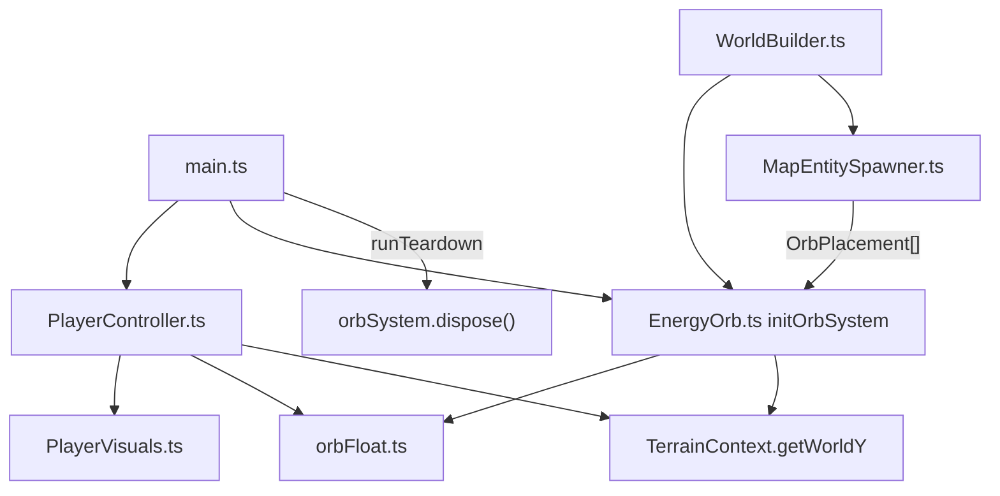

# Entities — Audit & Fixes

**Scope:** [src/entities/](src/entities/) — 6 files, ~378 lines. Player controller + visuals, energy orbs, shared float helpers, types.

**Goal:** Leaner, more correct code — minimize new helpers; prefer fixing bugs and inlining over abstraction.

**Parent overview:** Section 8 in [codebase_section_overview_f42eaa7c.plan.md](.cursor/plans/codebase_section_overview_f42eaa7c.plan.md).

---

## Architecture (verified)



**Hot path:** `gameTick.fixedUpdate` → `player.update` + `orbSystem.update` every frame. Orb count is map-authored (typically small). No GPU compute — CPU + scene graph only.

---

## Plan verification (re-check vs current codebase)

| Item | Verdict | Notes |
|------|---------|-------|
| A1 burst dispose leak | **Confirmed** | [EnergyOrb.ts](src/entities/EnergyOrb.ts) L215–221 disposes mesh + shared material only; burst `Points` from `spawnBurst` (L68–86) cleaned only when `updateBurst` reaches `t >= 1`. [main.ts](src/main.ts) L352 calls `orbSystem.dispose()` on `pagehide` — leak if absorb → teardown within 0.4s. |
| A2 speed bands | **Confirmed + user wants fix** | [PlayerController.ts](src/entities/PlayerController.ts) L15–21: hard step 1.0→0.5 at h=1.9; shore band [0.42, 1.1) at 0.65×. |
| B1 dead shim | **Confirmed** | [initOrbSystemFromMap.ts](src/entities/initOrbSystemFromMap.ts) re-exports `initOrbSystem` (unused) + `OrbPlacement` type. Only [MapEntitySpawner.ts](src/world/map/MapEntitySpawner.ts) L4 imports from shim; [WorldBuilder.ts](src/world/WorldBuilder.ts) L4 imports `initOrbSystem` directly from `EnergyOrb`. |
| C1 shared geometry | **Confirmed** | Each orb `new SphereGeometry(ORB_RADIUS, 24, 24)` at L63 — identical radius (0.22). Player orb (0.24) stays separate in PlayerVisuals. **Must not** `geometry.dispose()` per orb after C1 — only system dispose once. |
| D1 material cast | **Confirmed** | [PlayerVisuals.ts](src/entities/PlayerVisuals.ts) L56 weak optional cast. |
| D2 countVisibleOrbs | **Confirmed trivial** | L162 checks `!o.absorbed && o.mesh.visible`; absorb sets `visible = false` at L128. |
| Per-frame getWorldY/orb | **Out of scope** | N samples/frame negligible for authored orb counts. |
| Burst PointsMaterial vs TSL | **Out of scope** | 0.4s one-particle effect; converting is YAGNI. |
| Split EnergyOrb.ts | **Out of scope** | 224 lines, cohesive; splitting adds files without benefit. |
| [orbFloat.ts](src/entities/orbFloat.ts), [types.ts](src/entities/types.ts) | **Clean** | No changes. |

**Terrain/world changes elsewhere:** Entities still depend on `TerrainContext` from [TerrainGenerator.ts](src/world/TerrainGenerator.ts) (type-only facade over `MapTerrainContext`). No breakage from terrain audit — `getWorldY` signature unchanged.

---

## GitNexus blast radius (upstream, summaryOnly)

| Symbol | Risk | Direct (d=1) | Notes |
|--------|------|--------------|-------|
| `initOrbSystem` | **LOW** | `WorldBuilder.buildWorld` | Process: buildWorld |
| `OrbPlacement` | **LOW** | MapEntitySpawner + type re-export | Import path change only (B1) |
| `countVisibleOrbs` | **LOW** | `main.ts` HUD | Reveal module |
| `initPlayerController` | **LOW** | `main.ts` | Reveal module |
| `terrainSpeedMultiplier` | **LOW** | private fn in PlayerController | A2 is local |

All tasks are **LOW risk** — safe to implement without HIGH/CRITICAL warnings.

Run `impact({target, direction:"upstream"})` again before editing if index may be stale. Run `detect_changes()` before commit.

---

## Phase A — Bugs (correctness)

### A1 — Burst mesh leak on dispose

**File:** [src/entities/EnergyOrb.ts](src/entities/EnergyOrb.ts)

Add `dispose: () => void` to `EnergyOrb` interface. Per-orb dispose:

- If `burstMesh` active: `scene.remove`, geometry + PointsMaterial dispose, null ref.
- `scene.remove(mesh)` — do **not** dispose orb mesh geometry here once C1 lands (shared); until C1, keep per-orb geometry dispose in per-orb dispose, then move geometry dispose to system level in C1.

**System dispose** (L215–221): call `orb.dispose()` for each orb, then `orbMaterial.dispose()`.

### A2 — Smooth terrain speed bands

**File:** [src/entities/PlayerController.ts](src/entities/PlayerController.ts)

Replace L15–21 if/else with CPU `smoothstep` using existing `PHASE0.PLAYER.BIOME_SLOWDOWN_*` constants. No new config tunables — use a local transition width (~0.1 normalised height).

```typescript
// Nested mix: high band wins over shore band
const shoreW = smoothstep(LOW, LOW + BAND, h) * (1 - smoothstep(MID - BAND, MID, h));
const highW = smoothstep(HIGH - BAND, HIGH, h);
return mix(mix(1, LOW_MUL, shoreW), HIGH_MUL, highW);
```

Inline `smoothstep` helper in the same file (plain JS — do **not** import three.js for this). Mid band [MID, HIGH) stays ~1.0× at center; edges ease instead of stepping.

**Verify:** Walk shore → hills → peak; no visible speed pop at h=1.9 or band edges.

---

## Phase B — Structure / dead code

### B1 — Delete re-export shim

**Delete:** [src/entities/initOrbSystemFromMap.ts](src/entities/initOrbSystemFromMap.ts)

**Update:** [src/world/map/MapEntitySpawner.ts](src/world/map/MapEntitySpawner.ts) L4:

```typescript
import type { OrbPlacement } from '../../entities/EnergyOrb';
```

No other importers of the shim file.

---

## Phase C — Performance / lean

### C1 — Shared energy-orb sphere geometry

**File:** [src/entities/EnergyOrb.ts](src/entities/EnergyOrb.ts)

- Create one `SphereGeometry(ORB_RADIUS, 24, 24)` in `initOrbSystem`.
- Pass into `createEnergyOrb(..., sharedGeometry)`.
- Per-orb `dispose`: remove mesh from scene only — **no** `mesh.geometry.dispose()`.
- System `dispose`: after all `orb.dispose()`, call `sharedGeometry.dispose()` once + `orbMaterial.dispose()`.

**Depends on A1** — implement A1 and C1 in the same edit pass to `EnergyOrb.ts` so dispose ownership stays consistent.

---

## Phase D — Polish (trivial)

### D1 — PlayerVisuals material dispose

**File:** [src/entities/PlayerVisuals.ts](src/entities/PlayerVisuals.ts) L56

Replace `(orb.material as { dispose?: () => void }).dispose?.()` with `orb.material.dispose()`.

### D2 — Simplify countVisibleOrbs

**File:** [src/entities/EnergyOrb.ts](src/entities/EnergyOrb.ts) L159–165

```typescript
if (o.mesh.visible) n++;
```

Only consumer: [main.ts](src/main.ts) L319 (`orbVisibleCount` HUD).

---

## Suggested implementation batches

| Batch | Tasks | Files touched |
|-------|-------|---------------|
| 1 | A1 + C1 | `EnergyOrb.ts` |
| 2 | A2 | `PlayerController.ts` |
| 3 | B1 | delete shim, `MapEntitySpawner.ts` |
| 4 | D1 + D2 | `PlayerVisuals.ts`, `EnergyOrb.ts` |

Batch 4 can merge into Batch 1 if preferred (all entity-file edits).

---

## Verification

```bash
npx tsc --noEmit
npx biome check --write src/entities/ src/world/map/MapEntitySpawner.ts
npm run build
```

**Visual smoke test (full page reload):**

1. Absorb orb → immediately reload page (A1 burst cleanup).
2. Walk shore → mid → mountain — speed eases, no pops (A2).
3. Orb count HUD + burst VFX still correct (C1, D2).
4. Player orb still renders/disposes cleanly (D1).

---

## Progress: 2/6 tasks
