# Pantheon FPS Performance Audit

Six subsystem deep-dives, cross-verified against source and GitNexus (`updateSunShadowTarget`, `coastDistanceM`, `sortInstancesBackToFront`, `readCompactCountsFromGpu` all confirmed on the per-frame `gameTick.render` path). Severity reflects estimated frame-time impact at shipped defaults (DPR cap 2, SMAA + DoF on, reflective water, PCSS shadows).

## Frame anatomy (where the milliseconds go)

```mermaid
flowchart LR
    subgraph cpu [CPU per frame]
        tick[gameTick.render] --> grassUpd[grass update plus compact request]
        tick --> cloudCpu[cloud matrices plus sort ~736 instances]
        tick --> coast[water coast probe up to 73 height samples]
        tick --> horizon[sun horizon march 72 samples when moving]
    end
    subgraph gpu [GPU per frame]
        shadow[4096 shadow pass forced dirty plus R32F copy] --> scene[scene pass PCSS ~89 taps per fragment]
        reflect[water reflector extra scene pass] --> scene
        compact[grass compaction up to 1.9M threads] --> scene
        scene --> godrays[god rays 60 steps always on]
        scene --> bloomP[bloom 5-mip chain always on]
        godrays --> post[SMAA silhouette DoF FXAA LUT]
        bloomP --> post
    end
```

## Critical findings (fix these first)

### 1. Grass idle-refresh counter never resets — full compaction plus GPU readback every idle frame

`src/world/grass/core/GrassSystem.ts` (~~303–345). `staticFrameCount` only resets when the scene is dynamic. Once it passes `GRASS_TRAIL_REFRESH_FRAMES` (15), `trailRefreshDue` stays true forever, so a full compact pass (~~1.9M compute threads across 3 rings + flowers) runs **every frame while standing still**. Once it passes 60, `scheduleCompactCountReadback()` fires **every frame** — `renderer.getArrayBufferAsync` on 3–4 indirect buffers is a real GPU-to-CPU readback, and the `void` promise chains can pile up. The ring-skip optimization is also defeated because `canSkipIdleRings` requires `!trailRefreshDue`. Fix: reset the counter (or use modulo) after each refresh. **Severity: high — and it is a bug, not a tunable.**

### 2. Sun shadow map forced dirty every daytime frame at 4096 with PCSS

`src/rendering/sunShadow/followTarget.ts` (46–51) sets `sun.shadow.needsUpdate = true` whenever `sun.intensity > 0`, re-rendering all casters (terrain caster ~~131k tris, ~744 props on the dense map, ~736 cloud spheres) into a 4096x4096 map, then `PcssShadowNode.updateShadow` adds a fullscreen R32F depth-copy pass (`pcssShadowNode.ts` 72–88). Receive side (`pcssShadowFilter.ts`): 1 + 24 blocker taps + 16x4 bilinear taps = **~~89 shadow-map fetches per lit fragment**, paid on terrain (twice: detail + macro), grass LOD0/1, props, water, clouds. Cheapest wins: gate `needsUpdate` on snapped-target/sun/caster change, drop `mapSize` to 2048, tune sample counts, or profile with `usePcss: false` (WidePCF fallback already exists). Frustum constants are also rewritten + `updateProjectionMatrix()` every frame though they never change.

### 3. Post-FX passes run at full cost when their effect weight is zero

`src/rendering/postfx/createPostFxPipeline.ts` + controls. Zeroing a mix uniform does not stop the upstream passes:

- **God rays**: `GodraysNode` (60 raymarch steps at 0.5x, sampling the shadow map) + 2 bilateral blur passes + full-res 8-tap `depthAwareBlend` run all night / while the sun is behind a mountain; only `uGodRaysWeight` goes to 0 (`godraysControls.ts` 35–43, pipeline 88–95).
- **Bloom**: 5-mip half-res chain (~12 quads) always runs; cohesion only scales `uSceneBloomWeight` (`bloomControls.ts` 14–19).
- **Valley fog**: `scene.fogNode` stays attached with dual `triNoise3D` per fragment on all fogged materials even at midday when `uFogMaster` is 0 (`valleyFog.ts` 92–108). Editor nulls the fogNode; play mode never does.
- **LUT/grade**: always sampled, strength only zeroes the delta (`postGrade.ts` 133–140).
The rebuild-graph pattern (used correctly for FSR1/AA) exists — reuse it to disconnect god rays/bloom/fog when weight is ~0.

### 4. DoF always on + "CoC-gated FXAA" computes full FXAA anyway

`visualTuning.ts` `dof.ENABLED: true`; `DepthOfFieldNode` runs CoC at full res, 7 internal passes incl. 64-tap bokeh, every frame (bokeh scale never reaches 0 — 8 down to 3 with energy). When SMAA + DoF are active, `fxaa(color)` is fully evaluated then `mix`ed by CoC weight (`dofGatedFxaaTsl.ts` 23–29) — most of the frame is in focus, so FXAA cost is wasted. SMAA itself adds an input RTT + 3 passes + a custom multi-tap silhouette-resolve pass (`smaaChain.ts`, `smaaSilhouetteResolveTsl.ts`).

### 5. Grass scale: ~1.93M allocated instance slots; safety cap effectively disabled

`VISUAL.grass` rings derive to ~347k (LOD0, 4-segment blades) + ~530k + ~1.05M (LOD2 hits the 1024/side hard cap) slots — every compact pass dispatches threads for all of them. `maxInstancesPerRing: 600_000_000` in `visualTuning.ts` looks like a typo for the metrics default `600_000` (`grassFieldMetrics.ts` 28). Additionally, both the compact kernel **and** the draw vertex shader run the full terrain-surface sampler (biome map, macro height + 4-tap normal, snow `triNoise3D`, path, up to 6 disp-atlas samples) per instance/vertex — the draw shader ignores the height already packed in the SSBO (`grassMaterial.ts` 98–110). Any camera rotation marks the scene dynamic and recompacts everything.

### 6. Terrain splat fragment shader samples all biomes and overlays unconditionally

`biomeSplatShading.ts` (~~151–310): ~28–32 texture fetches per surviving fragment (4 biomes x color/normal/ORM/spec + snow/path/meadow overlays + masks) with no zero-weight gating, from ~6k^2 uncompressed RGBA atlases (~~820 MB VRAM across the 4 atlases, no KTX2/BC anywhere in the project). Paid twice (detail + macro materials), plus PCSS on top, plus again in the water reflection pass. Both play meshes have `frustumCulled = false`; the macro mesh covers the whole 800m world and its center disk is discard-overdraw.

### 7. Water reflector: extra scene pass including clouds

Default `tier: 'reflective'` renders sky + terrain + clouds again through the planar reflector (`PantheonWaterMeshClass.ts`, `waterReflectionLayers.ts`). Adaptive RT scaling (idle 0.05) is good, but cloud soft-sphere overdraw in the reflection is expensive and low-value; the terrain re-draw uses the full splat shader. The CPU-side coast probe costs up to 73 `getWorldY` calls **every frame** with no movement gate (`waterCoastProximity.ts` 25–33 — verified per-frame via GitNexus).

### 8. Clouds: per-frame CPU rewrite, mandatory sort, shadow casting

`MeshCloudSystem.ts` (182–242): every frame rewrites ~736 instance matrices, runs an O(n log n) JS sort with per-instance `subarray` churn, re-uploads the full instanceMatrix buffer, and (with `terrainInteractionEnabled`) up to ~736 `getWorldY` calls. `castShadows: true` puts all those spheres into the 4096 shadow map every frame; `receiveShadows: true` puts ~89-tap PCSS into the cloud fragment shader; `depthWrite: false` transparency makes stacked puffs heavy overdraw.

## Medium findings

- **CPU allocations in hot paths**: `getMovementDirection()` allocates `{x,y}` per fixed step (`InputManager.ts` 30); orb footing allocates an offsets array + result objects and does ~25 height samples per orb per 50Hz step (`orbTerrainFooting.ts`); `sampleLighting`/`activeCycle` spread new objects per call (`lightingCurves.ts` 94–96, 144–151); `readCloudSettings()` builds a ~30-field object per frame; `syncPantheonWater` builds a template-string key per frame; grass allocates a `Set` per compute frame.
- **Sun-horizon occlusion march**: 3 rays x 24 steps = 72 `getWorldY` + `atan2` per frame while moving/turning (`sunHorizonOcclusion.ts`); well-gated when stationary.
- **Foliage/pebble shadow casters on by default** (`VISUAL.props.shadowCast`), adding many alpha-tested casters for little visual return; hashed alpha at strength 1 on leaves; DoubleSide leaf cards.
- **Prop draw calls**: one InstancedMesh per asset key per GLTF primitive (~38 keys, ~40–55 color draws + nearly as many shadow draws); whole-mesh bounding spheres span the map so frustum culling rarely rejects; no per-instance culling for props.
- **Startup**: `compileAsync` covers the scene; post-FX variants warmed in 6.1; grade LUT awaited behind loading; night EXR diet + self-hosted Draco/Basis + KTX2 asset diet landed in 6.2.
- `**whenComputeReady()` await in the render loop** (`gameTick.ts` 202): verified *not* a GPU fence on three r185 (`computeAsync` resolves after enqueue) — cost is microtask serialization of RAF plus waiting on any in-flight rebuild. Low today, but becomes a hard per-frame sync if three ever makes `computeAsync` wait on GPU completion. Worth removing or documenting.

## Disputed / verify at runtime

- **"Terrain disp-atlas samples not skipped outside detailRadiusM"** (flagged high by the terrain scan): the samples are only *referenced* inside the TSL `If` (`terrainSurfaceHeightTsl.ts` 98–104), and TSL emits expression code lazily at first use, so the skip likely works as documented. Verify by dumping the compiled WGSL for the macro material before acting on it.

## What is done well (keep)

- DPR capped at 2; renderer MSAA off; FSR1 truly skipped when disabled; no MRT.
- GPU grass architecture: SSBO compaction to indirect draw, wrap-in-place rings, LOD-tiered materials, no per-frame instance uploads.
- Terrain LOD: ~394k verts vs 16.8M naive; early fragment discard; macro normal as varying; dedicated cheap 256-seg shadow caster.
- Dirty-checking in `syncTerrainSplatLighting`, `syncPantheonWater`, sky apply, bloom sky-reduce; scratch vectors throughout camera/shadow/player code.
- Event-driven HUD/reveal (no per-frame DOM); all dev tooling behind `import.meta.env.DEV`; night HDRI PMREM built once at load; proper dispose paths on map switch.

## Phased implementation plan

Ordered by impact-per-effort. Each phase is independently shippable and measurable. Measure before/after each phase with the dev panel Render debug ordered disables + periodic `renderer.info` (Profiling checklist in AGENTS.md). Full page reload after any `visualTuning.ts` change. Run GitNexus `detect_changes()` before each commit.

### Phase 1 — Bug fixes and frame-loop hygiene (low risk, immediate wins)

**1.1 Fix grass idle-refresh counters** — [src/world/grass/core/GrassSystem.ts](D:/pantheon/src/world/grass/core/GrassSystem.ts) (~296–345)

- Change the refresh conditions from latching to cadence: `trailRefreshDue = staticFrameCount > 0 && staticFrameCount % GRASS_TRAIL_REFRESH_FRAMES === 0`, same for `idleRingRefreshDue` with `GRASS_IDLE_RING_REFRESH_FRAMES` (constants in [grassConfig.ts](D:/pantheon/src/world/grass/config/grassConfig.ts)).
- Keep `staticFrameCount` incrementing while static so both cadences keep firing periodically; `canSkipIdleRings` then works again on non-refresh frames.
- Bound readbacks: add a `readbackInFlight` boolean around `scheduleCompactCountReadback()`; skip scheduling while one is pending, clear in `.finally`.
- Expected: idle GPU compute drops from ~1.9M threads/frame to once per 15 frames; idle readbacks drop from every frame to at most once per 60 frames.

**1.2 Fix the grass instance cap typo** — [src/config/visualTuning.ts](D:/pantheon/src/config/visualTuning.ts) (~695)

- `maxInstancesPerRing: 600_000_000` → `600_000` (matches `DEFAULT_MAX_INSTANCES_PER_RING` in [grassFieldMetrics.ts](D:/pantheon/src/world/grass/config/grassFieldMetrics.ts)).
- Caveat: capping shrinks LOD2's tile (~774/side x 0.14 m spacing = ~110 m coverage vs authored 334 m). Pair with a LOD2 density retune (e.g. `densityPerM2: 50` → ~10–15) so the tile still covers the authored outer radius with far fewer instances. Visual check on far grass coverage required.

**1.3 Hoist constant shadow frustum out of the per-frame path** — [src/rendering/sunShadow/followTarget.ts](D:/pantheon/src/rendering/sunShadow/followTarget.ts) (33–38)

- `cam.left/right/top/bottom` are constants (`SHADOW_FOLLOW_HALF`); set them once at setup (or behind a `framesInitialized` guard) and drop the per-frame `updateProjectionMatrix()`.

**1.4 Movement-gate the water coast probe** — [src/world/water/updateWaterReflectionQuality.ts](D:/pantheon/src/world/water/updateWaterReflectionQuality.ts) (67)

- Cache last probe XZ + result; re-run `coastDistanceM` only when the player moved > ~2 m (or on a 4–8 Hz timer). The smoothing damp already tolerates stale inputs. Saves up to 73 `getWorldY` calls/frame inland.

**1.5 Remove per-frame/fixed-step allocations** (one small PR, mechanical)

- [src/core/InputManager.ts](D:/pantheon/src/core/InputManager.ts) (30): pass a module-level scratch from `PlayerController.update` instead of defaulting to a fresh `{x,y}`.
- [src/entities/orbTerrainFooting.ts](D:/pantheon/src/entities/orbTerrainFooting.ts) (34–57): hoist `offsets` to a module const; return via out-param object reused per orb.
- [src/rendering/sky/lightingCurves.ts](D:/pantheon/src/rendering/sky/lightingCurves.ts) (94–96, 144–151): cache the merged cycle/exposure objects (invalidate when the DEV override changes); reuse a scratch `LightingSample`.
- [src/rendering/clouds/cloudConfig.ts](D:/pantheon/src/rendering/clouds/cloudConfig.ts) (122–158): cache `readCloudSettings()` result; rebuild only when dev settings dirty.
- [src/world/water/syncPantheonWater.ts](D:/pantheon/src/world/water/syncPantheonWater.ts) (36): replace the template-string sun key with two numeric epsilon compares.
- [src/world/grass/core/GrassSystem.ts](D:/pantheon/src/world/grass/core/GrassSystem.ts) (321): module-level `Set`, `.clear()` per use.
- [src/rendering/sky/hdri/nightHdriBlend.ts](D:/pantheon/src/rendering/sky/hdri/nightHdriBlend.ts) (6–11): cache the fade band object.

### Phase 2 — Shadow pipeline (biggest GPU win)

**2.1 Gate shadow map re-render on actual change** — DONE — [src/rendering/sunShadow/followTarget.ts](D:/pantheon/src/rendering/sunShadow/followTarget.ts) + [src/rendering/SceneSetup.ts](D:/pantheon/src/rendering/SceneSetup.ts)

- Shipped: `sun.shadow.autoUpdate = false`; bake + `needsUpdate` only when sun elevation/azimuth, follow XZ, light distance, or `invalidateSunShadowMap()` dirty.
- Swim fixes kept with gating: world-XZ texel snap (not light-view re-snap on rotating sun); receivers use baked sun direction from the DirectionalLight pose ([bakedSunDirection.ts](D:/pantheon/src/rendering/sunShadow/bakedSunDirection.ts)).
- Continuous sun angles by design — while the day cycle moves, the map still rebakes every frame. Do **not** re-quantize sun angle for perf (that caused stepping/reshuffle).
- `PcssShadowNode` depth-copy still rides the gated update.

**2.2 Shadow map resolution** — [src/config/visualTuning.ts](D:/pantheon/src/config/visualTuning.ts) (`SHADOW_LIGHTING.mapSize: 4096`)

- Profile 2048. Halves shadow raster + depth-copy + PCSS bandwidth (blocker search radius is in texels, so penumbra look shifts — re-check `shadowSoftnessMin/Max`).

**2.3 PCSS tap counts** — [src/rendering/sunShadow/pcssShadowFilter.ts](D:/pantheon/src/rendering/sunShadow/pcssShadowFilter.ts) (22–25)

- `BLOCKER_SAMPLE_COUNT 24` → 12–16, `FILTER_SAMPLE_COUNT 16` → 8–12 (~89 → ~45–65 fetches/fragment). Optionally lift both into `VISUAL.shadows.lighting` for a quality preset. Baseline compare against `usePcss: false` (WidePCF) to quantify what PCSS costs.

**2.4 Reduce caster set** — DONE (casters only) — [src/config/visualTuning.ts](D:/pantheon/src/config/visualTuning.ts) (`props.shadowCast`, `CLOUDS.castShadows`)

- Shipped: `shadowCast.foliage` / `pebbles` default `false`; clouds `castShadows: true` kept.
- Cloud map refresh cadence is **not** part of 2.4 — see 2.5.

**2.5 Cloud-only shadow refresh cadence** — DONE — [followTarget.ts](D:/pantheon/src/rendering/sunShadow/followTarget.ts) + [cloudDevState](D:/pantheon/src/rendering/clouds/cloudDevState.ts)

- When follow + sun are frozen and `VISUAL.clouds.castShadows` is on, refresh the shadow map every `CLOUD_SHADOW_REFRESH_FRAMES` (2) without re-posing the light / updating matrices — only `needsUpdate` so drifting cloud casters update.
- No sun-angle quantization.

### Phase 3 — Post-FX: stop paying for invisible effects

**3.1 God rays + bloom graph bypass** — [src/rendering/postfx/createPostFxPipeline.ts](D:/pantheon/src/rendering/postfx/createPostFxPipeline.ts) (82–107, 232–250)

- Parameterize `buildComposite(withGodrays, withBloom)`; when a flag is off, skip `depthAwareBlend`/`bloomAdd` so the upstream nodes are unreferenced and their passes don't run.
- Swap variants via the existing `rebuildPostGraph()` when `uGodRaysWeight` / effective bloom weight cross epsilon, with hysteresis (e.g. off after weight < 0.005 for 30 frames, on at > 0.01) to avoid thrash at dawn/dusk. Weights are already maintained in [godraysControls.ts](D:/pantheon/src/rendering/postfx/controls/godraysControls.ts) / [bloomControls.ts](D:/pantheon/src/rendering/postfx/controls/bloomControls.ts).
- Pre-compile all variants during the loading screen (see 6.1) so the swap is hitch-free.
- Expected: nights and occluded-sun periods drop the 60-step raymarch + 2 bilateral blurs + 12 bloom quads.

**3.2 Valley fog shader-side branch** — [src/rendering/atmosphere/valleyFog.ts](D:/pantheon/src/rendering/atmosphere/valleyFog.ts) (92–108)

- Do NOT swap `scene.fogNode` at runtime (invalidates every fogged material pipeline → hitch). Instead build `fogArea` inside an `Fn` with a real TSL `If(uFogMaster.greaterThan(0.001))` that assigns a `toVar` — the dual `triNoise3D` + `densityFogFactor` then only execute when haze is active. `select()` is not sufficient (WGSL evaluates both sides).

**3.3 CoC-gated FXAA** — [src/rendering/postfx/dofGatedFxaaTsl.ts](D:/pantheon/src/rendering/postfx/dofGatedFxaaTsl.ts) + [createPostFxPipeline.ts](D:/pantheon/src/rendering/postfx/createPostFxPipeline.ts) (219–228)

- First inspect whether `fxaa()` builds an inline TSL expression or its own RTT pass. If inline: wrap in `If(w > eps)` with `toVar` so in-focus pixels skip the FXAA neighborhood work. If it is a full pass: gate the whole gated-FXAA node on bokeh scale (skip when `uBokehScale` is near its floor) or run it at half res.

**3.4 DoF off-ramp** — [src/rendering/postfx/controls/dofControls.ts](D:/pantheon/src/rendering/postfx/controls/dofControls.ts) + `visualTuning.ts` `dof`

- The graph-swap machinery already exists (`isActive()` + `rebuildPostGraph`). Add a runtime threshold: when `uBokehScale` is at/below a "visually off" value, rebuild without the DoF node (7 passes incl. 64-tap bokeh). Also consider a `VISUAL.render` quality preset that ships DoF/SMAA-silhouette off.

### Phase 4 — Grass compute and draw shaders

**4.1 Use packed SSBO height in the draw shader** — [src/world/grass/render/grassMaterial.ts](D:/pantheon/src/world/grass/render/grassMaterial.ts) (98–110), [flowerMaterial.ts](D:/pantheon/src/world/grass/render/flowerMaterial.ts) (89–95), [grassSsbo.ts](D:/pantheon/src/world/grass/compute/grassSsbo.ts) (190–234), [grassSsboPack.ts](D:/pantheon/src/world/grass/compute/grassSsboPack.ts)

- Compute pass: pack the full surface Y (macro + detail disp, i.e. `sampleTerrainSurfacePosition(...).y`) instead of macro-only `heightNorm`. Word z has 16 unused low bits; 16-bit quantization over the 128 m height range is ~2 mm — sufficient. XZ can stay as-is (draw already derives world XZ from packed offsets + player uniform).
- Draw shaders: drop the `sampleTerrainSurfacePosition` call (biome map + 4-tap macro normal + snow `triNoise3D` + up to 6 disp samples per vertex) and use `unpackTerrainY` only.
- Safety argument: while the player moves, compaction runs every frame so packed Y is fresh; while static, world XZ doesn't change so packed Y stays exact. Verify no blade-float artifacts during fast motion.

**4.2 Remove the per-frame `await whenComputeReady()`** — [src/core/gameTick.ts](D:/pantheon/src/core/gameTick.ts) (202)

- Verified: `computeAsync` on three r185 resolves after enqueue, so the await is only microtask ordering. Replace with a rebuild-boundary-only await (`if (!grassSystem.isFieldReady()) await ...` or equivalent), keeping `render()` synchronous in the common path so RAF scheduling in [GameLoop.ts](D:/pantheon/src/core/GameLoop.ts) is not serialized behind promise chains. Accept possible 1-frame latency on compact submission (design already draws prev-frame indirect).

**4.3 Optional: throttle camera-only recompaction** — [GrassSystem.ts](D:/pantheon/src/world/grass/core/GrassSystem.ts) (300–305)

- When only `cameraMoved` (player static), consider compacting every 2nd frame. Experimental — verify no visible pop at the frustum edge (GPU cull already pads NDC). Ship behind a config flag.

### Phase 5 — Terrain, water, clouds GPU

**5.1 Verify the disp-atlas skip in WGSL** (blocking gate for terrain work) — [terrainSurfaceHeightTsl.ts](D:/pantheon/src/world/terrain/tsl/terrainSurfaceHeightTsl.ts) (98–104)

- **Done:** TSL static check — `mixBiomeDisplacement(...)` was invoked *outside* the `If` callback in both surface-height and splat displacement, so all 6 disp-atlas samples still emitted for every vertex; only the *scale* was gated. Moved the call into the `If` callback (play clipmap path). Editor / non-clipmap path still samples unconditionally.

**5.2 Gate splat fragment overlay samples** — [src/world/terrain/material/biomeSplatShading.ts](D:/pantheon/src/world/terrain/material/biomeSplatShading.ts) (~151–310)

- **Done:** Snow/path/meadow overlays gated with `If(weight > 1e-3)` + `toVar` accumulators. Snow/meadow use `biomeAtlasTileGrads` outside the branch + `sampleTiledAtlasWithGrad` inside (WGSL-legal); path stays mip-free vert samples. Shore foam ALU gated to near-waterline + tide-enabled in `waterIntersectionFoamTsl.ts`. Base 4-biome top-2 blend still deferred.

**5.3 Slim the water reflection pass** — [src/rendering/clouds/MeshCloudSystem.ts](D:/pantheon/src/rendering/clouds/MeshCloudSystem.ts) (327) + [terrainLodRings.ts](D:/pantheon/src/world/terrain/lod/terrainLodRings.ts) (93–102)

- **Done:** Detail terrain mesh off reflection layer (macro only). Clouds kept via `VISUAL.water.reflectClouds: 'proxy'` — one low-poly sphere per cluster on reflection-only layer (~particlesPerCloud× fewer draws); `full` / `off` still available. Main camera no longer enables layer 2 so proxies stay reflector-only.

**5.4 Cloud CPU + upload reduction** — [MeshCloudSystem.ts](D:/pantheon/src/rendering/clouds/MeshCloudSystem.ts) (101–127, 182–242)

- **Done:** Unrolled 16-float matrix copy (no `subarray` views). Wind writes particle-order scratch; painter sort refreshes on camera move (>1.5 m) or every 3rd frame, then packs every frame (no flicker). Terrain lift samples `getWorldY` once per cluster. Proxy/init path writes the mesh directly (does not touch shared sort buffers).

### Phase 6 — Startup and assets (load time + VRAM; supports Phase 3)

**6.1 Warm the post-FX pipeline before gameplay** — [src/main.ts](D:/pantheon/src/main.ts) (~276) + [createPostFxPipeline.ts](D:/pantheon/src/rendering/postfx/createPostFxPipeline.ts)

- **Done:** Await grade LUT behind loading screen (started early, awaited after `compileAsync`). `warmupEffectGraphs()` throwaway-renders all 4 god-rays × bloom wiring variants then restores night-start graph. New loading phase `shaders`.

**6.2 Compressed textures + asset diet** — DONE (see plan `asset_diet_ktx2`)

- Self-hosted Draco/Basis; `KTX2Loader` after `renderer.init()`; no CDN.
- Night EXR downscaled to 4096×2048; grass + props KTX2; terrain play atlases offline-baked (surface KTX2 + R8 disp).
- Play has no PNG/JPEG texture fallbacks for those paths; editor keeps runtime color-only terrain pack.
- Re-bake: `npm run sync-decoders` / `bake:night-exr` / `bake:grass-ktx2` / `bake:play-props` / `bake:terrain-atlases`.

### Explicitly deferred (low ROI or high risk)

- Per-instance prop culling / spatial bucketing of prop InstancedMeshes — real win on dense maps but a structural change; revisit after Phases 2–5 land.
- SMAA silhouette-resolve removal — quality-sensitive; expose as a preset toggle rather than deleting.
- `sun-horizon` march and orb footing sample counts — already gated/small; only revisit if CPU profiling shows them.

