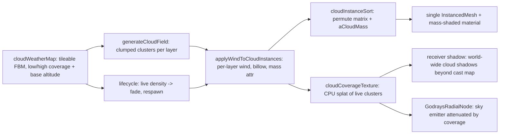

# Procedural cloud enhancements

## Research findings (current state)

- **Placement is uniform noise-free scatter.** `clusterCenter()` in [src/rendering/clouds/generateCloudField.ts](src/rendering/clouds/generateCloudField.ts) picks each center with an independent `cloudSeededRandom` over the 2400 m wrap box. There are about 22 clusters (50 × coverage 0.45), each with 32 spheres, so no banks or gaps form.
- **Lighting is per sphere.** `createCloudMeshMaterial` in [src/rendering/clouds/cloudMeshMaterial.ts](src/rendering/clouds/cloudMeshMaterial.ts) uses each sphere's own `normalWorld`, so a cloud reads as a pile of lit balls. Its back-light term is `-N·L` only, with no view-vs-sun forward scatter, so there is no silver lining.
- **Atmosphere links are limited.** Clouds set `fog = false` and get only the night valley haze, so distant clouds never blend into the day horizon. Cloud shadows exist only inside the ±200 m cast map. God rays test depth only, and clouds don't write depth, so shafts ignore clouds.
- **Motion is one rigid wind.** In [src/rendering/clouds/cloudWindInstances.ts](src/rendering/clouds/cloudWindInstances.ts) all genera share one travel vector, and clusters never change.
- **The dev slider ranges have drifted** in [src/dev/panel/sky/devPanelCloudsSpecs.ts](src/dev/panel/sky/devPanelCloudsSpecs.ts): `Base altitude` has min 80 (ships at 40), `Spread` has max 1600 (ships at 2400), and `Cloud count` has max 48 (ships at 50).
- **The installed Three.js `PassNode` has no layer API.** A cloud-only mask pass for god rays would need a second camera and scene traversal, so the plan uses analytic coverage instead.

## Target architecture

Keep one mesh and one sort for both layers. That keeps painter's order correct between low and high clouds and needs no new draw calls.

## Phase 1: Weather map and clumped, layered placement — DONE

- **Add `src/rendering/clouds/cloudWeatherMap.ts`.** It holds CPU tileable FBM with period equal to `spread` (wrap the lattice indices), stored in about 128² Float32 arrays:
  - `lowCoverage`: FBM plus a light Worley term for gaps.
  - `highCoverage`: separate seed and lower frequency.
  - `baseAltitude`: very low frequency, so neighboring clusters share a flat-bottomed base.
  - Density: `density = saturate((n - (1 - coverage)) / softness)`. Preset coverage becomes a threshold rather than just a count.
  - `sampleWeather(x, z, t)` returns density using two octaves that drift at different speeds, for later evolution.
- **Change [generateCloudField.ts](src/rendering/clouds/generateCloudField.ts):**
  - Generate jittered-grid candidates per layer, score them by density, and pick up to `cloudCount` by weighted sampling without replacement with a minimum spacing.
  - Scale spheres per cluster as `lerp(particlesMin, particlesMax, density)`, under a total `maxInstances` budget.
  - Add a `layer: 'low' | 'high'` field to `CloudParticlePlacement` and the cluster records.
- **Update [cloudProfiles.ts](src/rendering/clouds/cloudProfiles.ts)** with a new cumulus profile:
  - A flat condensation base: sphere bottoms are clamped to the mass base.
  - A cauliflower dome: larger puffs low and central, smaller toward the top and edges.
  - A `sizeMul` so high-layer cumulus is about 3× larger (puffs of roughly 40–110 m).
  - Stratus and cirrus keep their shapes and gain `sizeMul`.
- **Config ([src/config/visual/clouds.ts](src/config/visual/clouds.ts) and [cloudConfig.ts](src/rendering/clouds/cloudConfig.ts)):**
  - Add a `weather` block: `cellM`, `octaves`, `softness`, `evolveSpeed`.
  - Add `layers.low` with `baseY` 40, `jitter`, `cloudCount`, `particlesMin`/`particlesMax`, `sizeMul` 1, and terrain lift on.
  - Add `layers.high` with `baseY` about 400 m (above the 350 m peak scale), a larger `sizeMul`, and terrain lift off.
  - Add `maxInstances`.
  - Presets gain per-layer coverage and genus weights.
- **Fix the dev slider ranges** (min/max) to cover the shipped values, and add layout sliders for the new layer and weather keys (these trigger a rebuild).

## Phase 2: Shade each cluster as one mass

- **Add a per-instance `aCloudMass` vec4.** `xyz` is the offset from the cluster center in world orientation, divided by the cluster's extents; `w` is the life fade.
  - `applyWindToCloudInstances` already computes the world offset (`localX`/`localZ`), so it writes the vector into a scratch buffer there.
  - [cloudInstanceSort.ts](src/rendering/clouds/cloudInstanceSort.ts) `packSortedInstances` permutes it together with the matrices. `ensureCloudSortBuffers` gains a second scratch array.
  - The proxy mesh and init path write the attribute directly.
- **In [cloudMeshMaterial.ts](src/rendering/clouds/cloudMeshMaterial.ts),** read the attribute and build these terms:
  - `massN = normalize(aCloudMass.xyz)` and `N2 = normalize(mix(N, massN, uMassNormalMix))`. These drive wrap, sun-facing, and rim, so the whole cloud has one lit side and one shaded side.
  - A height gradient from `aCloudMass.y`: dark flat bases, bright tops (`uBaseShade`). This replaces the per-sphere `baseDarken`.
  - A cheap in-mass self-shadow: `pow(saturate(dot(massN, L) * 0.5 + 0.5), k)` on the sun term.
  - A silver lining: the Henyey-Greenstein phase on `dot(viewDir, -L)` (with `g` about 0.6) × `(1 - nDotV)` × sun color × `uSilverStrength`. Thin, backlit edges glow at golden hour.
  - A hemisphere ambient: the ambient color on top, a darker bounce on the bottom.
- **Add live sliders** (the existing `CLOUD_LIGHTING_SPECS` pattern) for mass normal mix, base shade, self-shadow, silver strength, and silver g.

## Phase 3: Motion and life cycle

- **Per-layer wind (shear).** Add `layers.high.windSpeedMul` and `windDirOffsetDeg`. The travel and sway in `applyWindToCloudInstances` are computed per layer. The high layer moves faster at a slight angle, which adds parallax.
- **Evolving coverage:**
  - The cluster set becomes a fixed pool. Every few frames, sample the live weather density at each cluster's advected center (the weather octaves drift relative to the wind), then ease a per-cluster `fade` toward it.
  - Faded clusters write zero-scale matrices: no fragments, no cast, no sort cost for pixels.
  - The instance scale is `lerp(0.6, 1, fade)`, so shadows grow and shrink smoothly.
  - A cluster that stays faded for more than N seconds respawns at a high-density spot: new center, rebuilt offsets, same slot.
- **Billowing:** a per-sphere slow scale breathe (a few %) in the wind loop, with the phase taken from the seed.
- **Water reflection proxies** ([cloudMeshLifecycle.ts](src/rendering/clouds/cloudMeshLifecycle.ts) `buildClusterProxyPlacements`) follow fade and respawn.

## Phase 4: Atmosphere integration

- **Distant clouds fade into the sky.** Add a cloud-only aerial term to the cloud material:
  - `smoothstep(cloudAerialStartM, cloudAerialEndM, horizDist) * uAerialStrength * cloudAerialMix`, mixed toward the valley `uFogColor`. The day aerial in [atmosphereTsl.ts](src/rendering/atmosphere/atmosphereTsl.ts) already uses that tint.
  - Also thin the alpha slightly.
  - Use its own distance range (about 900–2200 m), so near clouds stay crisp and the noon aerial doesn't dissolve them.
- **World-wide cloud shadows:**
  - Add `src/rendering/clouds/cloudCoverageTexture.ts`. The CPU splats each live cluster as an ellipse × fade into an RG8 texture over the wrap domain (about 256², roughly 9 m per texel; R = low layer, G = high layer), re-uploaded every few frames.
  - Shared uniforms: texture, spread, per-layer mean Y, strength.
  - In [createReceiverSunShadowNode.ts](src/rendering/sunShadow/createReceiverSunShadowNode.ts), both nodes project the receiver along the sun to each layer's height (`P.xz + L.xz * (layerY - P.y) / L.y`), sample the texture, and turn it into visibility.
  - Inside ±(200 m − band), keep the existing cast map. Beyond it, fade to the coverage term with the same Chebyshev `smoothstep` pattern as the near/far handoff (`mix`, never TSL `If` around samples). The result is combined into the existing visibility with `min`.
- **God rays through gaps.** In [GodraysRadialNode.ts](src/rendering/postfx/godrays/GodraysRadialNode.ts), for sky pixels (at the far-plane depth), intersect the view ray with the low and high layer planes, sample the coverage texture, and attenuate the emitter. This needs no extra scene pass. Clouds are placed from the same data, so the shafts line up at cluster scale. This is the last and optional item.

## Risk and verification

- **GitNexus impact (index 3 commits behind; re-analyze first):**
  - `createReceiverSunShadowNode` is **CRITICAL**: 4 direct callers feeding terrain (`buildMapTerrain`), grass (`initGrassSystem`), and both water meshes. Keep its signature, keep the `min` composition, and put a DEV toggle on the new term so it can be isolated.
  - `applyWindToCloudInstances` is **CRITICAL**: the per-frame `update`, `initMeshCloudSystem`, and dev-panel preset/reset rebuilds. Keep its call shape and add the layer and mass handling internally.
  - Before editing, run impact on `generateCloudField`, `createCloudMeshMaterial`, `packCloudInstancesWithOptionalSort`, `buildClusterProxyPlacements`, and `GodraysRadialNode`.
- **Performance:** larger high-layer puffs increase overdraw. Enforce `maxInstances` (start at about 2000), use zero-scale culling for faded clusters, and have you compare with Perf **Hide clouds** and the Inspector. The CPU splat is about N clusters × ~40 texels.
- **Checks:** `npx tsc --noEmit` plus a scoped `npx biome check` on the touched files. The repo-wide `npm run check` already fails on unrelated CRLF files. You do the visual QA: full page reload after `VISUAL.clouds` or shader-graph changes.
- **Docs:** update the cloud bullets and the Procedural clouds panel notes in `AGENTS.md` and `README.md`.

