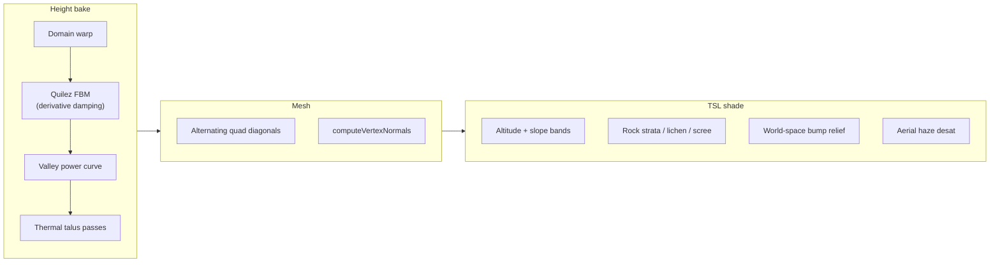

# TerrainGenerator → Authored Mountains Transfer

## Verdict

The mountains you like in `[D:\three\node_modules\three\examples\jsm\generators\TerrainGenerator.js](D:\three\node_modules\three\examples\jsm\generators\TerrainGenerator.js)` look realistic mostly because of **height structure**, not because of the procedural TSL paint. Pantheon already has richer materials (biome atlases, slope-rock, snow). The transferable win is: **bake Quilez-style eroded noise + thermal talus into `grids.height`**, then keep sculpting.

Recommended default: **height-first editor tools**; leave Pantheon splat shading alone for now (note a few cheap shading ideas as follow-ups).

---

## What makes TerrainGenerator mountains look good

Three independent layers in the addon:




| Technique                                       | What it does                                  | Why it reads “real”                             |
| ----------------------------------------------- | --------------------------------------------- | ----------------------------------------------- |
| **Derivative-damped FBM** (Quilez fake erosion) | Each octave `/ (1 + erosion * |∇|^2)`         | Detail piles on ridges; valleys stay smooth     |
| **Domain warp**                                 | Low-freq Perlin offsets sample XZ             | Ridges meander instead of axis-locked           |
| **Valley bias**                                 | `pow(h, valleyBias)`                          | Flat mist floor, sharp peaks                    |
| **Thermal / talus**                             | Multi-pass neighbor shed past angle of repose | Removes needle spikes; builds scree-like slopes |
| **Diamond triangulation**                       | Flip quad diagonal every other cell           | Less one-way mesh grain on coarse grids         |
| **Altitude/slope TSL**                          | Grass→forest→rock→scree→snow + strata         | Reads without textures                          |


Your sandbox (`[D:\three\src\terrain/main.js](D:\three\src\terrain\main.js)` + `[settings.js](D:\three\src\terrain\settings.js)`) exposes the knobs that matter: `erosion`, `warp`, `valleyBias`, `talus`, `talusPasses`.

---

## What Pantheon does today

Authored path (already solid plumbing):

```
SculptTool (bulk | ridge)
  → MapGrids.height (0..1 × HEIGHT_SCALE 128)
  → updateHeightTexture / applyHeightsToMesh
  → Play: GPU macro Y from uHeightTex + near detail disp
  → Save: map JSON
```


| Pantheon piece                                                                        | vs TerrainGenerator                                                           |
| ------------------------------------------------------------------------------------- | ----------------------------------------------------------------------------- |
| Bulk brush (`[gridBrush.ts](src/map/authoring/gridBrush.ts)` linear disc)             | Soft cones → blob massing                                                     |
| Ridge stamp (`[ridgeNoise.ts](src/map/authoring/ridgeNoise.ts)` ridged multifractal)  | Different algorithm; strength **0.06** = garnish only                         |
| “Fill mountains” (`[applyRidgeDetailToBiome](src/map/authoring/heightRidgeStamp.ts)`) | Same weak ridge overlay on Mountain biome                                     |
| **No** Quilez damping / warp / talus                                                  | Main structural gap                                                           |
| Biome splat + slope-rock + snow                                                       | Already covers (and exceeds) addon’s color story                              |
| PlaneGeometry + GPU height                                                            | Diamond index pattern mostly irrelevant                                       |
| Detail ring ~35 m                                                                     | Far silhouette = **macro height only** — texture won’t fix distant blob peaks |


So: transferring **shading** alone won’t fix the look you care about. Transferring **height algorithms** will.

---

## What to reuse (ranked)

### A. High value — port into editor height tools (do this)

Port the **CPU height core** from TerrainGenerator into `src/map/authoring/`, writing the same `grids.height` channel sculpt already owns. Mirror the existing “Fill mountains” + undo gesture pattern in `[EditorSession.onRidgeFillMountains](src/editor/core/EditorSession.ts)`.

1. `**thermalErodeHeightGrid**` — direct port of `thermalErode()`
  - Input: `Float32Array` heights, `N`, `cellSize`, `talus`, `passes`  
  - Operate in **world meters** (`h * HEIGHT_SCALE`) then write back normalized, or scale `talus` into 0..1 space carefully  
  - UI: toolbar **“Relax slopes”** (whole map or Mountain biome / dirty region)  
  - This alone improves hand-sculpted blobs: softens spikes, builds more believable flanks
2. `**sampleQuilezErodedHeight(worldX, worldZ, params)**` — port `heightField` / `eroded` / `warpField`
  - Depend on Three’s `[ImprovedNoise](https://github.com/mrdoob/three.js/blob/dev/examples/jsm/math/ImprovedNoise.js)` (same as the addon) or a small local Perlin  
  - Params: seed, frequency, octaves, lacunarity, gain, erosion, warp, valleyBias (skip `seaLevel`/`heightScale` or map them into 0..1 deltas)
3. **Editor actions that use (2)**
  - **Replace or upgrade Ridge mode**: stamp Quilez signal (zero-mean or ridge-biased) instead of/as alternative to current ridged MF  
  - **“Carve mountains” / “Apply eroded detail”**: batch over Mountain biome (like Fill mountains), with strength + seed  
  - Optional later: **region stamp** that *lays in* a full Quilez patch under a brush mask (generate then sculpt)
4. **Pipeline after mutate** (unchanged contract)
  `history.beginGesture` → mutate `grids.height` → `applyTerrainHeights()` / `applyHeightsToMesh` → `history.commitGesture` → save via MapIO

Do **not** call `TerrainGenerator.build()` at play runtime. Keep maps authored JSON.

### B. Medium value — selective only if height still feels flat up close

Pantheon materials already do rock/snow. Skip full procedural `terrainMaterial()`. Optional later overlays in `[biomeSplatShading.ts](src/world/terrain/material/biomeSplatShading.ts)`:

- Rock **strata** modulation (sin of world Y + noise) on mountain albedo  
- Stronger **scree** mid-steep band (addon’s screeMask)  
- Low-flat **cavity** darken

These are polish; they do not fix silhouette.

### C. Low / skip


| Addon piece                                | Why skip                                                                      |
| ------------------------------------------ | ----------------------------------------------------------------------------- |
| Full procedural color pipeline             | Conflicts with Poly Haven biome atlases + artist paint                        |
| Aerial haze in terrain shader              | Already owned by `[valleyFog.ts](src/rendering/atmosphere/valleyFog.ts)`      |
| Diamond triangulation                      | Play mesh is displaced planes; index pattern won’t change GPU silhouette much |
| Drop-in `TerrainGenerator` as world source | Contradicts authored-map design (`AGENTS.md` / MAPS.md)                       |


---

## Concrete first implementation slice

**Goal:** One new authoring module + two editor buttons, no play-path shader changes.


| File                                                                                                | Role                                                                                   |
| --------------------------------------------------------------------------------------------------- | -------------------------------------------------------------------------------------- |
| New `[src/map/authoring/quilezHeightField.ts](src/map/authoring/quilezHeightField.ts)`              | Port warp + derivative-damped FBM → 0..1 sample                                        |
| New `[src/map/authoring/thermalErode.ts](src/map/authoring/thermalErode.ts)`                        | Port talus passes on `grids.height`                                                    |
| New `[src/map/authoring/heightErosionStamp.ts](src/map/authoring/heightErosionStamp.ts)`            | Apply Quilez detail / thermal to biome or full grid (same shape as `heightRidgeStamp`) |
| `[src/config/visual/editor.ts](src/config/visual/editor.ts)`                                        | Tunables: erosion, warp, valleyBias, talus, talusPasses, quilez strength               |
| `[EditorUI.ts](src/editor/ui/EditorUI.ts)` + `[EditorSession.ts](src/editor/core/EditorSession.ts)` | “Eroded fill” + “Relax slopes” next to Fill mountains; undo-aware                      |


**Normalization note:** TerrainGenerator outputs world Y meters; Pantheon stores 0..1. Apply Quilez as **additive detail** `(n - mid) * strength` (like ridge) or as **blend toward generated massing** `mix(h, generated, mask)` for “lay in range” — start with additive detail + talus (safest for existing maps).

**Defaults to steal from your sandbox** (`[settings.js](D:\three\src\terrain\settings.js)`): `erosion: 0.7`, `warp: 0.35`, `valleyBias: 1.2`, `talus: 1`, `talusPasses: 12` — retune `frequency` for 800 m world (`WORLD.SIZE`) vs their 400.

---

## Risk / blast radius

- Height mutations affect grass bake, water shore, props placement, shadows, LOD macro — same as today’s sculpt; **must** go through existing `applyHeightsToMesh` path.  
- Thermal on whole 513² is cheap (CPU, ~12 passes). Quilez sample per cell is fine for one-shot fills; live brush should stay disc-local.  
- Full page reload after `visualTuning` / editor config changes per project rules.

---

## GitNexus verification (2026-07-31)

Index note: `gitnexus://repo/pantheon/context` reported **5 commits behind HEAD** (`terrain-updates`). Findings below are from the workspace index; re-run `node .gitnexus/run.cjs analyze` before implementation if the authoring/editor surface moved.

### Plan insertion points — confirmed LOW

| Symbol | Upstream risk | d=1 callers | Implication |
|--------|---------------|-------------|-------------|
| `applyRidgeDetailToBiome` | **LOW** (1 direct, 0 processes) | `onRidgeFillMountains` only | Correct template for new “Eroded fill”; add sibling API, do not rewrite ridge unless upgrading brush |
| `stampRidgeDetail` | **LOW** | `SculptTool.stampRidge` → `stamp` → `update` | Live Quilez brush is optional phase-2; batch fill first stays safer |
| `sampleRidgeNoise` | **LOW** | only `heightRidgeStamp` | Keep ridged MF as-is; new Quilez module is parallel, not a rename |
| `onRidgeFillMountains` | **LOW** (0 upstream) | wired as UI callback (not a named CALLS edge into UI) | Safe to add sibling handlers (`onErodedFillMountains`, `onRelaxSlopes`) the same way |

`context(applyRidgeDetailToBiome)` outgoing: `gridCellToWorldXZ`, `clampHeight`, `sampleRidgeNoise` — new stamps should reuse the same grid→world + clamp helpers (or extract them once) so Mountain-biome masking stays consistent.

### Do not modify (HIGH if touched) — call only

| Symbol | Upstream risk | Why plan is correct |
|--------|---------------|---------------------|
| `updateHeightTexture` | **HIGH** (→ `syncHeights` → `buildMapTerrain` / `createEditorSession` + `buildWorld`) | Shared play+editor height upload; new tools must call `terrain.applyHeightsToMesh` / session `applyTerrainHeights`, not reimplement upload |
| `applyGridHeightsToGeometry` | **HIGH** (editor mesh bake; createEditorSession processes) | Same — leave alone |
| `syncHeights` | **HIGH** | Canonical sync; already invoked via `applyHeightsToMesh` |

### Avoid restructuring

- `createEditorSession` downstream impact is **CRITICAL** (73 symbols, Ui/Tools/Lod/…). First slice = **additive handlers + new authoring files**, matching `onRidgeFillMountains` (~L273–290), not a session rewrite.
- Query for sculpt/height flows surfaces `CreateEditorSession → *` processes and `MapGrids` / `MapTerrainBuilder` — height tools stay in the **Authoring → EditorSession** corridor; play `buildWorld` only sees results after map save/reload.

### Shading follow-ups — deferred, still LOW but wrong phase

- `shadeFragment` upstream **LOW** (material composer only). Plan correctly keeps it out of slice 1; silhouette fix is height, not splat.

### Verified execution shape

```
EditorUI button
  → EditorSession handler (beginGesture)
  → NEW authoring mutate grids.height  // parallel to applyRidgeDetailToBiome
  → applyTerrainHeights()              // → applyHeightsToMesh → syncHeights / height tex
  → commitGesture
```

**Verdict:** GitNexus supports the plan as written. Safest implementation risk is **LOW** if we add new `src/map/authoring/*` modules + EditorSession/UI siblings and never edit `updateHeightTexture` / `syncHeights` / `applyGridHeightsToGeometry`. Touching those shared height-sync symbols would jump to **HIGH**.

---

## Out of scope for first slice

- Replacing bulk sculpt with live procedural generation  
- Play-time TerrainGenerator  
- Rewriting biome splat to match addon colors  
- Hydraulic erosion (addon only does thermal)
- Replacing `sampleRidgeNoise` / changing `SculptTool` ridge brush (phase-2 after batch tools feel right)

