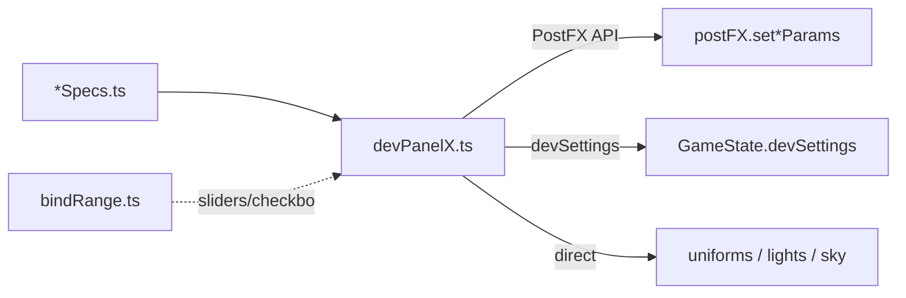

# UI — HUD & Dev Panels Deep-Dive Audit

**Scope:** [src/ui/](src/ui/) — ~35 TS files, ~5.1k lines. Player HUD/story/loading + DEV tuning panels.

**Goal:** Leaner, more consistent code — use existing `bindRange`/`bindCheckbox` helpers; no new helpers.

**Parent overview:** Section 9 in [codebase_section_overview_f42eaa7c.plan.md](.cursor/plans/codebase_section_overview_f42eaa7c.plan.md).

**Canonical plan file:** `D:\pantheon\.cursor\plans\ui_hud_dev_panels_audit_a2b13b33.plan.md` (repo, source of truth). Cursor Plan UI also reads `%USERPROFILE%\.cursor\plans\` — keep both copies identical. Supersedes stale `ui_hud_dev_panels_audit_3c0afd10.plan.md`.

---

## Re-verification summary (2026-07-03)

Plan re-checked against **current codebase** + **GitNexus** after GameState split and other section work.

| Finding | Status | Notes |
|---------|--------|-------|
| `bindRangeOnChange` dead code | **REMOVED from plan** | **Incorrect in v1.** Used by [devPanelGrass.ts:348](src/ui/dev/devPanelGrass.ts) for ring sliders (commit-on-release). GitNexus: 1 direct caller, LOW risk. **Do not delete.** |
| `_terrainMaterial` unused in terrain panel | **Valid (A1)** | [devPanelTerrain.ts:159-163](src/ui/dev/devPanelTerrain.ts) voids param. Shadow debug uses `ctx.terrainMaterial` on **shadows** context, not this param. GitNexus `initDevPanelTerrain`: LOW, 1 direct caller (`DevPanel.ts`). |
| Dead map-select CSS | **Valid (A2)** | [index.html](index.html) `.map-select-card__name/__id` unused; [MapSelectScreen.ts:51](src/ui/MapSelectScreen.ts) sets flat `textContent`. |
| Post FX hand-rolled checkboxes | **Valid (B1)** | [devPanelPostFx.ts:232-254](src/ui/dev/devPanelPostFx.ts) — `bindCheckbox` exists and is used elsewhere. |
| Terrain hand-rolled biome sliders | **Valid (B2)** | [devPanelTerrain.ts](src/ui/dev/devPanelTerrain.ts) uses `<span class="dev-out">` instead of `rangeRowHtml`/`bindRange`. |
| Shadow uniform map duplication | **Valid (C1)** | `readPropUniform`/`readFoliageUniform`/`readGroundContactUniform` maps duplicated inline in bind loops ([devPanelShadows.ts:45-78 vs 249-278](src/ui/dev/devPanelShadows.ts)). |
| Night HDRI id-switch sync | **Valid (C2)** | [devPanelNightHdri.ts:117-125](src/ui/dev/sky/devPanelNightHdri.ts) — godrays/water use keyed spec `read` fns. |
| Inline bloom/dof/haze specs | **Valid (D1-D3)** | godrays/water/shadows/postfx/grass already have `*Specs.ts`; bloom/dof/haze still inline. Grass specs now at [devPanelGrassSpecs.ts](src/ui/dev/devPanelGrassSpecs.ts) (moved into `ui/dev/` since overview was written). |
| StoryLog mutates `memoryFragments` | **Valid (E1-E2)** | Only consumer is [StoryLog.ts](src/ui/StoryLog.ts). Field lives in [state/gameState.ts](src/core/state/gameState.ts), exported via [GameState.ts](src/core/GameState.ts) barrel (GameState was split since overview). Follow [energy.ts](src/core/energy.ts) accessor pattern. GitNexus `initStoryLog`: LOW, 1 direct caller (`main.ts`). |
| Grass `closest('details').remove()` | **Investigate (A3)** | [devPanelGrass.ts:485](src/ui/dev/devPanelGrass.ts) — unique vs other panels; DevPanel already removes shell. |
| `stats.js` in prod bundle | **Valid optional (F1)** | [gameTick.ts:19](src/core/gameTick.ts) static-imports FpsCounter → stats.js; early-return in prod but still bundled. |

**Perf verdict unchanged:** Production HUD/story are event-driven (`EventBus`); no per-frame DOM. Only DEV FPS counter touches render loop. This audit is **code-quality / dedup / consistency**, not runtime perf (except optional F1 bundle trim).

**Out of scope (confirmed):** New helpers (`bindSelect`/`bindColor`/`bindButton`), CSS token consolidation, accessibility layer, gameplay FPS checkbox cross-panel coupling ([devPanelGameplay.ts:80-83](src/ui/dev/devPanelGameplay.ts) queries `#dev-show-fps` in Post FX section).

---

## Section snapshot

`src/ui/` ≈ **35 TS files** (~5.1k lines): player HUD/Story/MapSelect/Loading (~8 files, event-driven) + DEV panels `src/ui/dev/` (~27 files, `import.meta.env.DEV` gated).



---

## Phased implementation

| Phase | Tasks | Focus |
|-------|-------|-------|
| **A** | A1, A2, A3 | Dead code & quick wins |
| **B** | B1, B2 | Adopt existing `bindRange` / `bindCheckbox` helpers |
| **C** | C1, C2 | Shadow + night-HDRI wiring dedup |
| **D** | D1, D2, D3 | Extract bloom/dof/haze `*Specs.ts` |
| **E** | E1, E2 | Story `memoryFragments` → core accessors |
| **F** | F1 (optional) | Prod bundle: dynamic-import `stats.js` |

Frontmatter `todos` ids match task ids (`a1-drop-terrain-material-param` = **A1**, etc.).

### Phase A — Dead code & quick wins (~15 min, LOW risk)

| ID | Task | Files |
|----|------|-------|
| **A1** | Drop unused `_terrainMaterial` param from `initDevPanelTerrain` + stop passing it in [DevPanel.ts:70-73](src/ui/DevPanel.ts) | `devPanelTerrain.ts`, `DevPanel.ts` |
| **A2** | Remove unused `.map-select-card__name` / `__id` rules from [index.html](index.html) | `index.html` |
| **A3** | Confirm grass dispose `body?.closest('details')?.remove()` is redundant with DevPanel teardown; remove if so | `devPanelGrass.ts` |

**Verify:** `npx tsc --noEmit`, `npm run check`, dev panel terrain section still mounts.

---

### Phase B — Adopt existing helpers (~30 min, LOW risk)

No new helpers — use `bindCheckbox`, `rangeRowHtml`, `bindRange`, `syncSpecs` from [bindRange.ts](src/ui/dev/bindRange.ts).

| ID | Task | Files |
|----|------|-------|
| **B1** | Replace hand-rolled Post FX checkbox listeners ([devPanelPostFx.ts:232-254](src/ui/dev/devPanelPostFx.ts)) with `bindCheckbox` | `devPanelPostFx.ts` |
| **B2** | Terrain biome accordions: generate rows via `rangeRowHtml`, bind via `bindRange`, sync via `syncSlider`/`syncSpecs`. Keep per-biome `<details>` shell; fix `<span class="dev-out">` → `<output>` consistency | `devPanelTerrain.ts` |

**Verify:** Post FX cohesion/grade/LUT toggles + reset; terrain biome sliders + snow section + reset.

---

### Phase C — Panel wiring dedup (~30 min, LOW risk)

| ID | Task | Files |
|----|------|-------|
| **C1** | Extract shared `PROP_UNIFORM_MAP` / `FOLIAGE_UNIFORM_MAP` / `GROUND_CONTACT_UNIFORM_MAP` constants used by both `read*Uniform` and bind loops | `devPanelShadows.ts` |
| **C2** | Add `key` + `read(tuning)` to `HDRI_SPECS` (mirror `GodraysSpec`); replace id-switch chain in `syncNightHdriPanel` | `devPanelNightHdri.ts` |

**Verify:** Shadow sliders sync/reset; night HDRI sliders sync when scrubbing sun elevation.

---

### Phase D — Spec extraction for consistency (~25 min, LOW risk)

User chose: extract inline specs to match godrays/water/shadows/postfx/grass pattern.

| ID | Task | Files |
|----|------|-------|
| **D1** | Extract `devPanelBloomSpecs.ts` (`BloomSpec[]`, `ALL_BLOOM_SPECS`) | `devPanelBloom.ts` + new specs file |
| **D2** | Extract `devPanelDofSpecs.ts` | `devPanelDof.ts` + new specs file |
| **D3** | Extract `devPanelHazeSpecs.ts` | `devPanelHaze.ts` + new specs file |

**Verify:** `npm run check`; panel behaviour unchanged (sliders, reset, `tickBloomPanelSync`).

---

### Phase E — Story progression separation (~20 min, LOW risk)

| ID | Task | Files |
|----|------|-------|
| **E1** | Add `hasMemoryFragment(id)` / `recordMemoryFragment(id)` in new [src/core/memoryFragments.ts](src/core/memoryFragments.ts) (mirror [energy.ts](src/core/energy.ts)); export from [GameState.ts](src/core/GameState.ts) barrel. Storage stays `state.memoryFragments` in [state/gameState.ts](src/core/state/gameState.ts). | `core/memoryFragments.ts`, `GameState.ts` |
| **E2** | [StoryLog.ts](src/ui/StoryLog.ts) calls accessors; no direct `.includes()` / `.push()` on `state.memoryFragments` | `StoryLog.ts` |

**Verify:** Orb pickup → fragment 1; energy thresholds → fragments 3/7/10/14; reveal cap → fragment 16; dedup still works.

---

### Phase F — Optional / defer (~15 min)

| ID | Task | When |
|----|------|------|
| **F1** | Dynamic-import `stats.js` inside `ensureStats()` in [FpsCounter.ts](src/ui/FpsCounter.ts) | If prod bundle size matters; verify Vite tree-shaking |
| — | Move `DevPanel.ts`/`DevPanelLayout.ts` under `src/ui/dev/` | **Skip** — pure import churn, no lean win |

---

## GitNexus blast radius (pre-change)

| Symbol | Risk | Direct callers | Notes |
|--------|------|----------------|-------|
| `initDevPanelTerrain` | LOW | `DevPanel.ts` | A1 signature change |
| `initStoryLog` | LOW | `main.ts` | E2 internal only |
| `bindRangeOnChange` | LOW | `devPanelGrass.ts` | **Keep — not dead** |

---

## Verification (each phase)

```bash
npx tsc --noEmit
npm run check
```

Dev-panel phases: full page reload + exercise affected section (sliders, checkboxes, reset). Phase E: gameplay story trigger smoke test.

## Progress: 0/12 required (A1–E2); F1 optional
