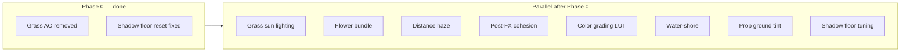

# Visual Fidelity Pass (beyond props)

## Current state

Phase A (prop canopy depth) is **done**. Skipping bark normals and GTAO.

**Phase 0 is done:** grass procedural AO was **removed** (0A — invisible in play, not worth keeping); shadow receiver floor dev sliders **fixed** + macro terrain wired (0B).

The render stack already has strong terrain PBR splat, bloom/god rays/DoF/AgX, Preetham sky + night HDRI, reflective water, and per-receiver shadow floors. Gaps are mostly **grass parity**, **atmospheric cohesion**, and **shore/ground integration**.

---

## Phase 0 — Fix broken dev levers ✅ done

### 0A. Grass blade AO — removed

**Resolution:** Procedural blade AO was wired correctly but effectively invisible in play. Rather than tune defaults/shader guards, the system was **removed entirely**:

- AO block removed from `[grassMaterial.ts](src/world/grass/render/grassMaterial.ts)`
- `uAoScale` / `uAoRimSmoothness` / `uAoRadiusSquared` removed from `[grassUniforms.ts](src/world/grass/config/grassUniforms.ts)`
- `aoScale` / `aoRimSmoothness` / `aoRadius` removed from `VISUAL.grass`, `GameState`, and dev panel **Appearance** sliders
- **Wind shade** (`baseWindShade`, `baseShadeHeight`) retained — separate base-of-blade darkening

---

### 0B. Shadow receiver floor sliders reset every frame ✅ done

**Root cause (confirmed):** `[applyShadowFloorDisable](src/rendering/sunShadow/sunShadowDebugTargets.ts)` ran every DEV frame via `postFX.render` → `applyRenderDebug` → `applyShadowDebugOverrides`. When "Disable shadows" was **off**, it still reset all floors to `VISUAL.shadows.receivers` defaults — overwriting slider values.

**Implemented:**

- `applyShadowFloorDebugOverride` — only force floors to `1` when `disableShadows === true`; otherwise no-op (slider values persist)
- Edge-trigger restore to `VISUAL` defaults when toggling **Disable shadows** off (`[shadowDebugOverrides.ts](src/dev/shadowDebugOverrides.ts)`)
- Macro terrain `uShadowFloor` wired in `[main.ts](src/main.ts)`; `setShadowFloor('terrain', v)` mirrors detail + macro

**Key files:** `[sunShadowDebugTargets.ts](src/rendering/sunShadow/sunShadowDebugTargets.ts)`, `[shadowDebugOverrides.ts](src/dev/shadowDebugOverrides.ts)`, `[devPanelShadows.ts](src/ui/dev/devPanelShadows.ts)`, `[main.ts](src/main.ts)`

---

## Parallel workstreams (any order after Phase 0)

### 1. Grass sun lighting

**Gap:** Grass is `albedo × sunShadow × night/glow` — no N·L wrap or hemisphere. Props have this via `[mapPropShadingTsl.ts](src/world/mapProps/mapPropShadingTsl.ts)`; grass does not.

**Approach:**

- Extract or share a lightweight `applyFoliageShading` TSL helper (wrap half-Lambert + sky/ground hemisphere) from prop shading
- Add `uSunDirection`, `uWrapStrength`, `uHemisphereStrength`, sky/ground tints to `[grassSharedUniforms](src/world/grass/config/grassUniforms.ts)`
- Sync `uSunDirection` in `[syncSunShadowReceivers.ts](src/rendering/sunShadow/syncSunShadowReceivers.ts)` (grass currently skipped)
- Add `VISUAL.grass.foliageLighting` block (reuse or fork `FOLIAGE_LIGHTING` constants)
- Integrate in `[grassMaterial.ts](src/world/grass/render/grassMaterial.ts)` **before** shadow multiply; resolve blade normals (`SpriteNodeMaterial` — may need `normalNode` or geometry-facing normal for half-Lambert)
- Dev sliders in `[devPanelGrass.ts](src/ui/dev/devPanelGrass.ts)`

**Open questions (deep dive later):** Keep simple `applySunShadowVisibility` vs adopt `computePropSunShadowMul` for tree-shadow consistency; normal strategy for billboard blades.

---

### 2. Flower sprites (bundle with grass)

**Gap:** `[flowerMaterial.ts](src/world/grass/render/flowerMaterial.ts)` uses only `applyGrassNightLighting` — no sun shadow, no wrap/hemi. `receiveShadow = false`.

**Approach:** After grass sun lighting lands, pass `createSunShadowNode` into flowers, enable `receiveShadow`, apply same shading stack as grass (shared TSL module). Minimal extra code if bundled with workstream 1.

**Key files:** `[flowerMaterial.ts](src/world/grass/render/flowerMaterial.ts)`, `[flowerRingField.ts](src/world/grass/render/flowerRingField.ts)`

---

### 3. Shadow receive harmony (production tuning)

**Gap:** Receiver floors diverge widely (terrain `0.06`, grass `0.35`, props `0.4`, water `0.08`) — canopy shadows feel disconnected from ground.

**Approach (after Phase 0B fix):**

- Use dev panel floors to find cohesive values under tree canopies (daylight, sun revealed)
- Commit tuned defaults to `[VISUAL.shadows.receivers](src/config/visualTuning.ts)`
- Document intent per receiver (terrain dims sun terms only; grass multiplies albedo; props have `shadowStrength` scaler)
- No new code unless persisting dev overrides to `GameState` is desired

---

### 4. Atmospheric perspective (distance haze)

**Gap:** No scene fog. Atmosphere is sky + god rays + vignette (energy reveal) + HDRI horizon dim only. Materials set `fog = false`.

**Preferred approach:** Post-pass depth haze in `[createPostFxPipeline.ts](src/rendering/postfx/createPostFxPipeline.ts)` — exponential mix toward sky/horizon color using scene depth. Avoids per-material fog flags and works on terrain/grass/props/water uniformly.

**Plan:**

- New `VISUAL.atmosphere.haze` block (density, start distance, height falloff, color source: sky horizon vs fixed tint)
- New TSL module e.g. `hazeEffect.ts` inserted after AgX or before (decide HDR vs display-referred during implementation)
- Sample horizon color from sky system or `VISUAL.sky` constants for day/night match
- DEV toggle + sliders in render debug or new atmosphere subsection
- Profile cost (single fullscreen pass, cheap)

**Alternative (heavier):** Per-material camera-distance tint in terrain/prop shaders — more control, more maintenance.

---

### 5. Water–shore integration

**Gap:** Water is a radial disc with `[waterEdgeFadeTsl.ts](src/world/water/waterEdgeFadeTsl.ts)` fade; terrain shore is height-splat in `[biomeSplatWeights.ts](src/world/terrain/tsl/biomeSplatWeights.ts)`. Adaptive reflection quality uses **island AABB distance** (`[updateWaterReflectionQuality.ts](src/world/water/updateWaterReflectionQuality.ts)`), not actual coast geometry. No foam/shallow tint.

**Approach (incremental tiers):**

- **Tier 1 (tuning):** Edge fade, alpha, distortion, reflection `resolutionScale` / `inlandFloor` in `[VISUAL.water](src/config/visualTuning.ts)` — dev panel already exists (`[devPanelWater.ts](src/ui/dev/devPanelWater.ts)`)
- **Tier 2 (shore-aware):** Sample terrain height or shore biome weight in water shader to modulate opacity/color near `waterY`; optionally drive reflection weight from shore proximity instead of island bounds
- **Tier 3 (polish):** Shallow tint, optional foam band, seafloor alignment in `[MapTerrainBuilder.ts](src/world/MapTerrainBuilder.ts)`

**Extension points:** `waterEdgeFadeTsl.ts`, `syncPantheonWater.ts`, `updateWaterReflectionQuality.ts`

---

### 6. Post-FX cohesion pass

**Gap:** Elevation already links exposure (`[lightingCurves.ts](src/rendering/sky/lightingCurves.ts)` → `uExposure`), bloom sky reduce, and god-ray weight. Otherwise bloom, god rays, vignette, and DoF are independently tuned.

**Approach:**

- Add `VISUAL.postfx.cohesion` master scalars (or extend existing bloom/godrays blocks) driven from `sampleLighting()` / sun elevation
- Couple: bloom scene weight, god-ray intensity/weight, optional vignette bleed at golden hour
- Reduce DEV panel drift — document which sliders override the curve vs follow it
- Keep changes in `[createPostFxPipeline.ts](src/rendering/postfx/createPostFxPipeline.ts)` + `[skyRevealBlend.ts](src/rendering/sky/skyRevealBlend.ts)`

**Not in scope:** Rebuilding the HDR composite graph or merging bloom/godrays into one node.

---

### 7. Prop ground-contact tint

**Gap:** No darkening or terrain-color bleed at prop bases — props can look "floating" on grass/terrain.

**Approach:**

- World-space Y (or height-above-terrain) factor in `[mapPropShadingTsl.ts](src/world/mapProps/mapPropShadingTsl.ts)`: darken/multiply albedo near ground contact
- Optional: sample macro terrain color (expensive) vs simple ground-tint darkening (cheap)
- Tunables in `VISUAL.props.groundContact` + dev slider in `[devPanelShadows.ts](src/ui/dev/devPanelShadows.ts)` or props section
- Category-aware: stronger on rocks/trunks, subtle on foliage cards

**Open question:** Height-above-terrain needs terrain sample or bbox heuristic — scope during deep dive.

---

### 8. Color grading LUT

**Gap:** Post stack is AgX + exposure + vignette only (`[godraysComposite.ts](src/rendering/postfx/godraysComposite.ts)`). No saturation/contrast/LUT. Renderer uses `NoToneMapping` in `[SceneSetup.ts](src/rendering/SceneSetup.ts)`.

**Approach:**

- Add `VISUAL.grade` block: optional LUT path (`public/textures/grade/*.cube` or PNG strip), saturation, contrast, lift
- New `postGrade.ts` chained after AgX in post pipeline
- Start with **procedural grade** (saturation + contrast uniforms) before committing to artist LUT workflow
- DEV panel in bloom section or new **Grade** subsection
- Keep `outputColorTransform = false` pattern

**Open question:** Artist-authored 3D LUT vs procedural only — decide when implementing.

---

## Suggested dependency notes

| Workstream            | Depends on                                                |
| --------------------- | --------------------------------------------------------- |
| Grass sun lighting    | None                                                      |
| Flowers bundle        | Grass sun lighting                                        |
| Shadow harmony tuning | Phase 0B (done)                                           |
| Distance haze         | None (but looks best after shadow/grass cohesion)         |
| Post-FX cohesion      | None                                                      |
| Water-shore           | None                                                      |
| Prop ground tint      | None                                                      |
| Color grading LUT     | None (apply after other color changes to avoid re-tuning) |

---

## Out of scope (confirmed)

- GTAO / SSAO
- Bark normal maps on props
- Full PBR prop upgrade
- Translucent two-pass foliage

---

## Verification checklist (per workstream)

- **Phase 0:** ✅ Shadow floor sliders hold values; grass AO removed (wind shade retained)
- **Grass/flowers:** Meadow reads cohesive with tree canopy; flowers match grass under sun/shadow
- **Shadows:** Tree shadow on terrain/grass/props feels like one system
- **Haze:** Distant hills/trees soften into sky without flattening foreground
- **Water:** Shore transition believable on maps with coast
- **Post/LUT:** Golden hour feels authored, not stacked; no DEV/production exposure fighting
- Full page reload after `visualTuning.ts` changes; grass material changes may need reload

---

## GitNexus verification (Phase 0)

Verified 2026-06-25. Both Phase 0 sub-plans confirmed **LOW risk**, isolated blast radius. **Both completed.**

- [Phase 0A — Grass AO](C:/Users/jesse.mogensen/.cursor/plans/phase_0a_grass_ao_11e52db2.plan.md): resolved by **removing** procedural AO (not implementing original fix plan)
- [Phase 0B — Shadow Floors](C:/Users/jesse.mogensen/.cursor/plans/phase_0b_shadow_floors_ba64319e.plan.md): implemented — `applyShadowFloorDebugOverride`, macro terrain mirror