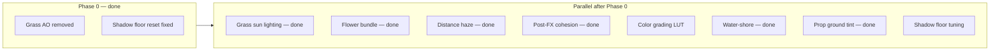

# Visual Fidelity Pass (beyond props)

## Current state

Phase A (prop canopy depth) is **done**. Skipping bark normals and GTAO.

**Phase 0 is done:** grass procedural AO was **removed** (0A — invisible in play, not worth keeping); shadow receiver floor dev sliders **fixed** + macro terrain wired (0B).

**Grass + flowers foliage lighting is done:** shared wrap/hemisphere TSL, sun direction + color sync, fake SSS back-light on grass/flowers only (props keep wrap/hemi — no back-light). Dev sliders under **Grass → Sun lighting**.

**Distance haze is done:** valley band + distance fog via `scene.fogNode` (`valleyFog.ts`), `VISUAL.atmosphere.haze`, elevation-driven cycle strength, DEV panel **Atmosphere / haze**.

**Water–shore is done:** terrain-height shore depth (Beer-Lambert opacity, shallow tint, refraction), tide + intersection foam on terrain, night fog bypass on water/foam, map-bounds open-ocean mask, dev panel **Water** sliders.

**Post-FX cohesion is done:** `VISUAL.postfx.cohesion` + `postfxCohesion.ts` golden-hour curve; `syncPostFxCohesion` drives scene bloom weight, god-ray weight, and reveal vignette bleed; DEV **Post FX → Cohesion**.

**Prop ground-contact tint is done:** `VISUAL.props.groundContact` + `propGroundContactTsl.ts` height-above-terrain darken/tint; category strengths (bark/foliage/default); DEV **Shadows → Ground contact**.

The render stack already has strong terrain PBR splat, bloom/god rays/DoF/AgX, Preetham sky + night HDRI, reflective water, and per-receiver shadow floors. Remaining gaps are mostly **shadow harmony tuning** and **color grading**.

---

## Phase 0 — Fix broken dev levers ✅ done

### 0A. Grass blade AO — removed

**Resolution:** Procedural blade AO was wired correctly but effectively invisible in play. Rather than tune defaults/shader guards, the system was **removed entirely**:

- AO block removed from `[grassMaterial.ts](src/world/grass/render/grassMaterial.ts)`
- `uAoScale` / `uAoRimSmoothness` / `uAoRadiusSquared` removed from `[grassUniforms.ts](src/world/grass/config/grassUniforms.ts)`
- `aoScale` / `aoRimSmoothness` / `aoRadius` removed from `VISUAL.grass`, `GameState`, and dev panel **Appearance** sliders
- **Wind shade** (`baseWindShade`, `baseShadeHeight`) retained — separate base-of-blade darkening

---

### 0B. Shadow receiver floor sliders reset every frame ✅ done

**Root cause (confirmed):** `[applyShadowFloorDisable](src/rendering/sunShadow/sunShadowDebugTargets.ts)` ran every DEV frame via `postFX.render` → `applyRenderDebug` → `applyShadowDebugOverrides`. When "Disable shadows" was **off**, it still reset all floors to `VISUAL.shadows.receivers` defaults — overwriting slider values.

**Implemented:**

- `applyShadowFloorDebugOverride` — only force floors to `1` when `disableShadows === true`; otherwise no-op (slider values persist)
- Edge-trigger restore to `VISUAL` defaults when toggling **Disable shadows** off (`[shadowDebugOverrides.ts](src/dev/shadowDebugOverrides.ts)`)
- Macro terrain `uShadowFloor` wired in `[main.ts](src/main.ts)`; `setShadowFloor('terrain', v)` mirrors detail + macro

**Key files:** `[sunShadowDebugTargets.ts](src/rendering/sunShadow/sunShadowDebugTargets.ts)`, `[shadowDebugOverrides.ts](src/dev/shadowDebugOverrides.ts)`, `[devPanelShadows.ts](src/ui/dev/devPanelShadows.ts)`, `[main.ts](src/main.ts)`

---

## Parallel workstreams (any order after Phase 0)

### 1. Grass sun lighting ✅ done

**Implemented:**

- Shared TSL in `[foliageWrapHemisphereTsl.ts](src/rendering/tsl/foliageWrapHemisphereTsl.ts)` — wrap half-Lambert, hemisphere, fake SSS back-light + shadow punch-through
- `VISUAL.grass.foliageLighting` (`GRASS_FOLIAGE_LIGHTING`) — separate from props `FOLIAGE_LIGHTING`
- Uniforms + sync in `[grassUniforms.ts](src/world/grass/config/grassUniforms.ts)`, `[syncSunShadowReceivers.ts](src/rendering/sunShadow/syncSunShadowReceivers.ts)` (`uSunDirection`, `uSunColor`, wrap/hemi/backlight)
- Card-facing normal via `transformNormal(vec3(0,0,1))` + low-sun scatter in `[grassMaterial.ts](src/world/grass/render/grassMaterial.ts)`
- Dev sliders in `[devPanelGrass.ts](src/ui/dev/devPanelGrass.ts)` — **Grass → Sun lighting**
- Props use wrap/hemi only (`[mapPropShadingTsl.ts](src/world/mapProps/mapPropShadingTsl.ts)`); prop fake SSS was tried and **removed** per artist preference

---

### 2. Flower sprites (bundle with grass) ✅ done

**Implemented:**

- `[flowerMaterial.ts](src/world/grass/render/flowerMaterial.ts)` — same wrap/hemi + back-light stack as grass; `createSunShadowNode` passed from `[GrassSystem.ts](src/world/grass/core/GrassSystem.ts)`
- `[flowerRingField.ts](src/world/grass/render/flowerRingField.ts)` — `receiveShadow = true`

---

### 3. Shadow receive harmony (production tuning)

**Gap:** Receiver floors diverge widely (terrain `0.06`, grass `0.35`, props `0.4`, water `0.08`) — canopy shadows feel disconnected from ground.

**Approach (after Phase 0B fix):**

- Use dev panel floors to find cohesive values under tree canopies (daylight, sun revealed)
- Commit tuned defaults to `[VISUAL.shadows.receivers](src/config/visualTuning.ts)`
- Document intent per receiver (terrain dims sun terms only; grass multiplies albedo; props have `shadowStrength` scaler)
- No new code unless persisting dev overrides to `GameState` is desired

---

### 4. Atmospheric perspective (distance haze) ✅ done

**Implemented:**

- `VISUAL.atmosphere.haze` + `valleyFog.ts` — scene `fogNode` valley band + distance haze (webgpu custom fog pattern)
- Elevation-driven fog strength via `hazeCycleStrength.ts`; sun sync in `main.ts`
- DEV panel `[devPanelHaze.ts](src/ui/dev/devPanelHaze.ts)` + render-debug sync
- Water + shore foam fog bypass so shallow coast stays readable at night

---

### 5. Water–shore integration ✅ done

**Implemented (tiers 1–3 core):**

- **Shore depth:** terrain height sampling in `waterDepthTsl.ts` — coast fade, Beer-Lambert absorption, shallow scatter tint, refraction mask, shadow opacity boost
- **Tide + foam:** `waterTideTsl.ts` + `waterIntersectionFoamTsl.ts` on terrain; aligned macro XZ ripple; `foamWaterlineBias` overlap
- **Night readability:** water fog bypass (`PantheonWaterNodeMaterial`) + foam haze attenuation
- **Tuning:** `VISUAL.water.shoreDepth` + `VISUAL.water.tide`; dev panel `[devPanelWater.ts](src/ui/dev/devPanelWater.ts)`
- Edge fade + reflection quality remain in `waterEdgeFadeTsl.ts` / `updateWaterReflectionQuality.ts`

---

### 6. Post-FX cohesion pass ✅ done

**Implemented:**

- `VISUAL.postfx.cohesion` — golden-hour curve (`postfxCohesion.ts`), separate from `sampleLighting` (GitNexus CRITICAL hub)
- `syncPostFxCohesion` in render loop — scene bloom weight, god-ray blend multiplier, sky bloom mask, reveal vignette bleed
- Pipeline: `setCohesionScalars` on `PostFXContext`; render-debug overrides still win
- DEV **Post FX → Cohesion** with base-vs-curve help text; AgX exposure stays on sky day-cycle path

---

### 7. Prop ground-contact tint ✅ done

**Implemented:**

- `VISUAL.props.groundContact` — fade height, darken max, ground tint, category strengths (bark / foliage / default)
- `[propGroundContactTsl.ts](src/world/mapProps/tsl/propGroundContactTsl.ts)` — macro height texture sample, height-above-terrain fade, albedo darken + ground-tint blend in `[mapPropShadingTsl.ts](src/world/mapProps/mapPropShadingTsl.ts)`
- `[propGroundContactUniforms.ts](src/world/mapProps/propGroundContactUniforms.ts)` — init after terrain build in `[WorldBuilder.ts](src/world/WorldBuilder.ts)`
- DEV **Shadows → Ground contact** in `[devPanelShadows.ts](src/ui/dev/devPanelShadows.ts)`

---

### 8. Color grading LUT

**Gap:** Post stack is AgX + exposure + vignette only (`[godraysComposite.ts](src/rendering/postfx/godraysComposite.ts)`). No saturation/contrast/LUT. Renderer uses `NoToneMapping` in `[SceneSetup.ts](src/rendering/SceneSetup.ts)`.

**Approach:**

- Add `VISUAL.grade` block: optional LUT path (`public/textures/grade/*.cube` or PNG strip), saturation, contrast, lift
- New `postGrade.ts` chained after AgX in post pipeline
- Start with **procedural grade** (saturation + contrast uniforms) before committing to artist LUT workflow
- DEV panel in bloom section or new **Grade** subsection
- Keep `outputColorTransform = false` pattern

**Open question:** Artist-authored 3D LUT vs procedural only — decide when implementing.

---

## Suggested dependency notes

| Workstream            | Depends on                                                |
| --------------------- | --------------------------------------------------------- |
| Grass sun lighting    | None — **done**                                           |
| Flowers bundle        | Grass sun lighting — **done**                             |
| Shadow harmony tuning | Phase 0B (done)                                           |
| Distance haze         | None — **done**                                           |
| Post-FX cohesion      | None — **done**                                           |
| Water-shore           | None — **done**                                           |
| Prop ground tint      | None — **done**                                           |
| Color grading LUT     | None (apply after other color changes to avoid re-tuning) |

---

## Out of scope (confirmed)

- GTAO / SSAO
- Bark normal maps on props
- Full PBR prop upgrade
- Translucent two-pass foliage

---

## Verification checklist (per workstream)

- **Phase 0:** ✅ Shadow floor sliders hold values; grass AO removed (wind shade retained)
- **Grass/flowers:** ✅ Shared foliage TSL + back-light; flowers receive sun shadow; dev sliders live — verify meadow cohesion vs tree canopy in play
- **Shadows:** Tree shadow on terrain/grass/props feels like one system
- **Haze:** ✅ Distant hills/trees soften into sky; coast/water bypass where needed
- **Water:** ✅ Shore transition believable — depth tint, tide, foam stripe aligned with water surface
- **Props:** ✅ Ground-contact darken/tint at bases; category-aware strengths
- **Post/LUT:** ✅ Golden hour bloom/god rays breathe together via cohesion; DoF stays energy-driven; color grade LUT still pending
- Full page reload after `visualTuning.ts` changes; grass material changes may need reload

---

## GitNexus verification (Phase 0)

Verified 2026-06-25. Both Phase 0 sub-plans confirmed **LOW risk**, isolated blast radius. **Both completed.**

- [Phase 0A — Grass AO](C:/Users/jesse.mogensen/.cursor/plans/phase_0a_grass_ao_11e52db2.plan.md): resolved by **removing** procedural AO (not implementing original fix plan)
- [Phase 0B — Shadow Floors](C:/Users/jesse.mogensen/.cursor/plans/phase_0b_shadow_floors_ba64319e.plan.md): implemented — `applyShadowFloorDebugOverride`, macro terrain mirror