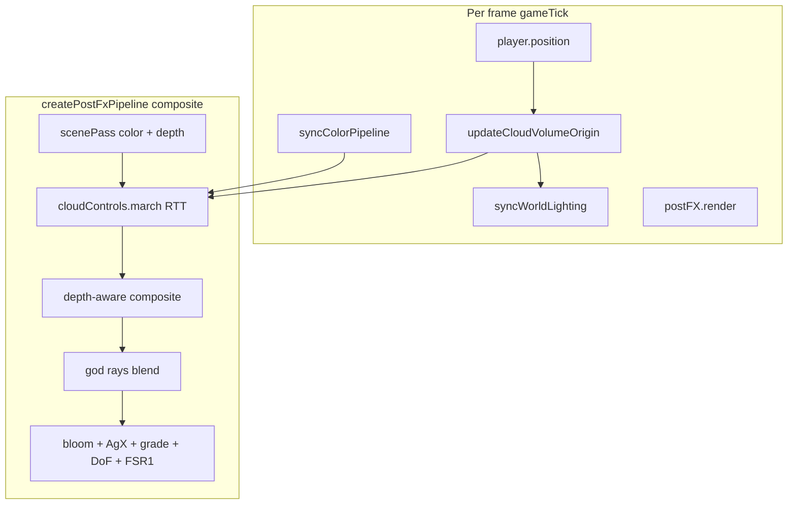

# Volumetric clouds — implementation plan

## Decision (locked)

- **Build native TSL** under `src/rendering/atmosphere/volumetricClouds/` — do not npm-install either reference repo.
- **Algorithm reference:** [Simon Dev Shaders_Clouds1](https://github.com/simondevyoutube/Shaders_Clouds1) (bake + adaptive march + composite).
- **Lighting reference:** FarazzShaikh / Nubis envelope + multiscattering vocabulary (phase 3+ only).
- **Scope:** Full 3D fly-through + terrain cloud shadows (phased).
- **Keep orthogonal:** [`valleyFog.ts`](src/rendering/atmosphere/valleyFog.ts) (ground haze), [`SkySystem.ts`](src/rendering/sky/SkySystem.ts) (Preetham dome + HDRI crossfade).

---

## GitNexus integration map

| Symbol | Risk | Callers / role |
|--------|------|----------------|
| [`createPostFxPipeline`](src/rendering/postfx/createPostFxPipeline.ts) | **LOW** (d=1: `initPostFX` → `main`) | Primary hook — cloud composite inside `composite()` before god rays |
| [`initPostFX`](src/rendering/PostFX.ts) | LOW | Extend `PostFXContext` with cloud sync API if needed |
| [`syncWorldLighting`](src/rendering/worldLighting.ts) | MEDIUM | Phase 5 — push cloud shadow into terrain materials |
| [`syncTerrainSplatLighting`](src/world/terrain/material/syncTerrainSplatLighting.ts) | MEDIUM | Phase 5 — new `uCloudSunAttenuation` or similar |
| [`syncColorPipeline`](src/rendering/postfx/syncColorPipeline.ts) | LOW | Phase 3 — cloud tint vs `elevationDeg` / daylight |
| [`gameTick`](src/core/gameTick.ts) | LOW | Per-frame: update volume origin, `postFX.render()` at line ~191 |

**Impact before editing:** run `impact({ target: "createPostFxPipeline" })` and `impact({ target: "syncTerrainSplatLighting" })` — both verified LOW–MEDIUM.



---

## Target pipeline (after implementation)

Current composite in [`createPostFxPipeline.ts`](src/rendering/postfx/createPostFxPipeline.ts) (~L75–98):

```
sceneColor → godrays depthAwareBlend → bloom → AgX → vignette
```

**New:**

```
sceneColor → cloudComposite(sceneColor, cloudScatter, sceneDepth) → godrays → bloom → …
```

Cloud pass runs at **same resolution scale as scene pass** (FSR1 `resolutionScale` when enabled). Reuse [`ensureLowResOutput`](src/rendering/postfx/createPostFxPipeline.ts) pattern for any cloud RTT that must stay low-res through FSR1.

---

## Module layout (new files)

```
src/rendering/atmosphere/volumetricClouds/
  index.ts                      # public exports
  cloudVolume.ts                # player-follow AABB state + updateCloudVolumeOrigin()
  cloudTunables.ts              # types mirroring VISUAL.sky.volumetricClouds
  bake/
    loadCloudNoiseTextures.ts   # load shipped 3D Perlin-Worley (+ optional SDF)
    perlinWorleyBake.ts         # DEV: one-time bake → public/textures/environment/
  tsl/
    cloudDensityTsl.ts          # sample 3D tex, wind, shape/detail remap
    cloudMarchTsl.ts            # view march + light march (Simon Dev port)
    cloudCompositeTsl.ts        # front-to-back over scene RGB, depth test
    cloudShadowTsl.ts             # Phase 5: sun march → shadow map write
  controls/
    createCloudControls.ts      # mirrors createGodraysControls pattern
  cloudShadowMap.ts             # Phase 5: ortho RT + follow player
```

**Assets** (ship under `public/textures/environment/`):

- `cloud-perlin-worley.bin` or `.ktx2` — 32³ or 64³ RGBA (baked offline or DEV bake)
- `blue-noise.png` — dither for march offset (may share with other effects)

---

## Phase 1 — Foundation (scaffold + data)

**Goal:** Volume exists in world space; density samples work in isolation (no post-FX yet).

### 1.1 Config types

Add to [`visualTuning.ts`](src/config/visualTuning.ts):

```ts
sky: {
  volumetricClouds: {
    enabled: true,
    volumeHalfExtentM: 300,      // horizontal half-size of player-follow box
    baseHeightM: 80,
    topHeightM: 180,
    windSpeed: 0.02,
    viewStepsMax: 48,
    viewStepsMin: 16,
    lightSteps: 8,
    density: 0.5,
    coverage: 0.6,
    // Phase 5:
    shadowMapSize: 256,
    shadowStrength: 0.7,
    skymeshCloudFade: 0.15,      // reduce SkyMesh cloudCoverage when volumetrics on
  },
}
```

Mirror in `cloudTunables.ts`; runtime copy in dev settings if live sliders needed (Phase 4).

### 1.2 Player-follow volume

[`cloudVolume.ts`](src/rendering/atmosphere/volumetricClouds/cloudVolume.ts):

- `CloudVolumeState { originXZ, baseY, topY, halfExtent }`
- `updateCloudVolumeOrigin(playerX, playerZ)` — snap or lerp origin to player (match grass ring snap style)
- `getCloudAabb()` → `{ min, max }` for march entry/exit
- Called from [`gameTick.ts`](src/core/gameTick.ts) before `postFX.render()`

### 1.3 Noise texture

**Preferred:** Ship pre-baked 3D texture (avoid 2s startup bake on every load).

- Port Simon Dev `generator-shader.glsl` logic to a **one-time DEV script** or `perlinWorleyBake.ts` using TSL compute / fullscreen slice passes
- Output: `Data3DTexture` loaded via [`loadCloudNoiseTextures.ts`](src/rendering/atmosphere/volumetricClouds/bake/loadCloudNoiseTextures.ts)
- Add path to [`assetManifest.ts`](src/assets/assetManifest.ts) if preloaded at bootstrap

### 1.4 TSL density stub

[`cloudDensityTsl.ts`](src/rendering/atmosphere/volumetricClouds/tsl/cloudDensityTsl.ts):

- `sampleCloudDensity(worldPos, uniforms)` — 3D tex sample + height falloff within AABB
- No march yet; unit-test visually via debug RTT in Phase 2

**Exit criteria:** Build passes; volume origin tracks player; 3D texture loads; density Fn compiles.

---

## Phase 2 — Post-FX integration

**Goal:** Clouds visible in play mode, composited over scene, respecting terrain depth.

### 2.1 `createCloudControls`

Pattern: [`createGodraysControls`](src/rendering/postfx/controls/godraysControls.ts)

Inputs: `sceneColor`, `sceneDepth`, `camera`, `sun`, `cloudVolumeUniforms`

Outputs:

- `cloudScatterTex` — RGB scattering + A transmittance (or RGBA)
- `uCloudWeight` — day/night + dev disable
- `updateFromSun(elevationDeg, intensity)` — fade at night

### 2.2 March pass

[`cloudMarchTsl.ts`](src/rendering/atmosphere/volumetricClouds/tsl/cloudMarchTsl.ts) — port Simon Dev `CloudMarch`:

1. Ray–AABB intersect (early out sky pixels miss volume)
2. Blue-noise offset on march start
3. Coarse steps (SDF optional in Phase 3) → HQ sub-steps near surface
4. Light march with dual-lobe HG + multi-octave scattering approx
5. Stop at `sceneDepth` when ray hits terrain **in front of** cloud sample

**Camera inside volume:** if `insideAABB(camera)`, start march at `t=0`.

### 2.3 Composite hook

In [`createPostFxPipeline.ts`](src/rendering/postfx/createPostFxPipeline.ts) `composite()`:

```ts
const baseSample = sceneColor.sample(uv);
const cloudLayer = cloudControls.sample(uv);  // or pre-RTT
const sceneRgb = cloudComposite(baseSample.rgb, cloudLayer, sceneDepth, camera);
const withRaysSample = depthAwareBlend(sceneColor, godraysBlur, ...); // uses original sceneColor for depth mask
// mix godrays over sceneRgb as today
```

Use [`depthAwareBlend`](src/rendering/postfx/depthAwareBlend.js) or dedicated `cloudCompositeTsl` — clouds **before** god rays so shafts pass through lit cloud air.

### 2.4 PostFXContext API (minimal)

Extend [`PostFX.ts`](src/rendering/PostFX.ts):

- `setCloudVolumeOrigin(x, z)` or pass via `setCloudUniforms(...)` each frame
- `setCloudWeightFromSun(elevationDeg, intensity)` — called from `syncColorPipeline` or gameTick

Wire in [`main.ts`](src/main.ts) bootstrap alongside `postFX` / `skySystem`.

**Exit criteria:** Fly through cloud box; terrain occludes clouds when looking at ground; god rays still work; render debug can skip cloud weight = 0.

---

## Phase 3 — Production visuals + SkyMesh handoff

**Goal:** Adaptive performance, wind animation, cohesive day/night look.

### 3.1 SDF envelope skip (optional but recommended)

- Bake 128³ SDF envelope (Simon Dev `sdf-generator-shader.glsl` port)
- Coarse march steps = SDF distance until near surface → HQ 16-step sub-march
- **GitNexus:** no new upstream callers; isolated in cloud module

### 3.2 Quality / perf knobs

- Detail dropout by distance to sample (Simon `t_detailDropout`)
- Cap `viewStepsMax` at 48 default; `viewStepsMin` 16
- `lightSteps` 6–8

### 3.3 SkyMesh coexistence

In [`applySkyForReveal`](src/rendering/sky/skyRevealBlend.ts) or [`SkySystem.setSkyParams`](src/rendering/sky/SkySystem.ts):

- When `VISUAL.sky.volumetricClouds.enabled`: set `cloudCoverage *= skymeshCloudFade`
- Keep turbidity / sun disc / HDRI crossfade unchanged

### 3.4 Color cohesion

- Cloud sun colour from `uSunColor` / `sampleLighting` elevation curves
- Ambient term scales with `skySystem.getDaylight()`
- Hook from [`syncColorPipeline`](src/rendering/postfx/syncColorPipeline.ts) (same call site as god-ray cohesion)

**Exit criteria:** Stable 60fps target at default FSR1 scale on island map; no double-clouds with SkyMesh; golden hour reads correctly.

---

## Phase 4 — Config, DEV panel, profiling

### 4.1 `VISUAL.sky.volumetricClouds`

Shipped tunables in [`visualTuning.ts`](src/config/visualTuning.ts); document reload required for structural changes.

### 4.2 Dev panel

Extend [`devPanelSkyPreetham.ts`](src/ui/dev/sky/devPanelSkyPreetham.ts) or add `devPanelVolumetricClouds.ts`:

| Slider | Field |
|--------|-------|
| Density | `density` |
| Coverage | `coverage` |
| Base height | `baseHeightM` |
| Top height | `topHeightM` |
| View steps max | `viewStepsMax` |
| Light steps | `lightSteps` |
| Wind speed | `windSpeed` |
| Shadow strength | `shadowStrength` (Phase 5) |

Live update via cloud controls uniforms (mark dirty pattern like terrain).

### 4.3 Render debug

Add to [`RenderDebugSettings`](src/core/state/settingsTypes.ts):

- `disableVolumetricClouds: boolean`

Wire in:

- [`devPanelRenderDebug.ts`](src/ui/dev/devPanelRenderDebug.ts) — checkbox after "Disable haze"
- [`createCloudControls`](src/rendering/atmosphere/volumetricClouds/controls/createCloudControls.ts) — `uCloudWeight = 0` when disabled
- **Profiling checklist** in [`AGENTS.md`](AGENTS.md): hide sky → disable clouds → disable haze → god rays → …

**Exit criteria:** All sliders functional; disable toggle in profiling order.

---

## Phase 5 — Terrain cloud shadows

**Goal:** Ground and slopes receive cloud shadow modulation (independent of sun shadow map).

### 5.1 Cloud shadow map

[`cloudShadowMap.ts`](src/rendering/atmosphere/volumetricClouds/cloudShadowMap.ts):

- **256²** ortho RT aligned to sun direction (or top-down slice through volume at mid altitude)
- Follow player with cloud volume origin
- Each frame: simplified sun march through density field → write transmittance (R channel)
- Reuse density sampling from `cloudDensityTsl.ts` (no full view march)

### 5.2 Terrain uniform

Add to [`biomeSplatUniforms.ts`](src/world/terrain/material/biomeSplatUniforms.ts):

- `uCloudShadowTex`, `uCloudShadowMatrix` (world → shadow UV), `uCloudShadowStrength`

In [`biomeSplatShading.ts`](src/world/terrain/material/biomeSplatShading.ts):

- Sample shadow tex at `worldXZ` (or world position)
- Multiply sun diffuse: `sunDiffuse *= mix(1, cloudShadow, uCloudShadowStrength)`
- Apply **before** existing `sunVisFloor` / baked sun shadow so both stack

### 5.3 Sync path

New `syncCloudShadowUniforms(materials, cloudShadowState)` called from [`syncWorldLighting`](src/rendering/worldLighting.ts) after `syncTerrainSplatLighting`.

**GitNexus:** `syncTerrainSplatLighting` callers = `syncWorldLighting` + editor `runLoop` — editor must receive cloud shadows too.

### 5.4 Grass / props (defer)

- Phase 5b: grass sun visibility (`grassNightLightingTsl.ts`) — optional follow-up
- Map props use same sun — consider `mapPropShadingTsl` in phase 5b

**Exit criteria:** Walking under cloud casts soft shadow on terrain; shadow moves with wind slowly; no shadow when `disableVolumetricClouds`.

---

## Phase 6 — Verification

| Check | Command / action |
|-------|------------------|
| Typecheck + bundle | `npm run build` |
| Lint | `npm run check` (changed files) |
| GitNexus regression | `detect_changes({ scope: "compare", base_ref: "main" })` — expect Postfx + Sky + Material clusters |
| Visual | Full reload; island map — fly through layer, orbit peaks, energy reveal day cycle |
| Perf | Dev panel render debug — disable list; compare GPU info with clouds on/off |
| Editor | `editor.html` — cloud shadows on terrain sculpt preview |
| Night | Clouds fade with `syncColorPipeline` / HDRI weight |

---

## Performance budget (targets)

| Setting | Default | Notes |
|---------|---------|-------|
| Internal res | Match FSR1 `resolutionScale` (0.67–1.0) | Same as scene pass |
| View steps | 16–48 adaptive | SDF skip reduces average |
| Light steps | 8 | Per HQ sample only |
| Shadow map | 256², 1 channel | Phase 5 only |
| Skip pixels | AABB miss + below horizon fast-out | |

**Avoid:** full-res 128-step march on all pixels; merging into `fogNode`; second full scene pass.

---

## Explicit non-goals (this plan)

- Envelope erosion (Nubis) — future polish
- Temporal reprojection — only if half-res shimmer remains
- Grass/prop cloud shadows — phase 5b
- Coupling cloud shadow into [`sunShadow`](src/rendering/sunShadow) CSM — phase 6+ if needed
- npm dependency on either GitHub cloud repo

---

## Reference porting checklist (Simon Dev → TSL)

| GLSL source | Pantheon TSL target |
|-------------|---------------------|
| `generator-shader.glsl` | `perlinWorleyBake.ts` → shipped asset |
| `sdf-generator-shader.glsl` | `sdfEnvelopeBake.ts` (Phase 3) |
| `fragment-shader.glsl` `CloudMarch` | `cloudMarchTsl.ts` |
| `CalculateLightEnergy` | `cloudMarchTsl.ts` light loop |
| `MultipleOctaveScattering` | `cloudMarchTsl.ts` helper Fn |
| `main.js` 0.5x RT | scene pass scale + `ensureLowResOutput` |
| Blue noise | `uniform(texture)` + frame golden-ratio offset |

FarazzShaikh: read for multiscattering vocabulary only; do not fork `CloudsRenderer` React code.
