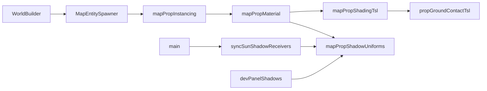

# World — Map Props & misc Audit

**Scope:** [src/world/mapProps/](src/world/mapProps/) (8 files, ~620 lines) + misc top-level world ([JourneyPath.ts](src/world/JourneyPath.ts), [TerrainGenerator.ts](src/world/TerrainGenerator.ts), [WorldConfig.ts](src/world/WorldConfig.ts), [disposeWorldTerrain.ts](src/world/disposeWorldTerrain.ts)).

**Goal:** Leaner, more correct code — no new helpers unless clearly warranted. Match phased approach from terrain audit.

**GitNexus:** `MapPropPlacement` and `propCategoryMulUniform` impact = **LOW** — prop-build path only (`mapPropMaterial` → `MapEntitySpawner` → `WorldBuilder` → `main.ts`). No per-frame hot path.



---

## Plan verification (review pass)

| Item | Verdict | Notes |
|------|---------|-------|
| A1 instanceIndex | **Confirmed** | Written in spawner; never read. Instancing uses array index `i`. |
| A2 Placement alias | **Confirmed** | Zero TS importers (UI "Placement" strings unrelated). |
| A3 surfaceLift | **Added in review** | `MapEntity` has per-entity `surfaceLift`; spawner buckets by asset key and keeps **first** lift for all instances — editor supports per-entity lift. |
| B1 isSoftFoliage 4× | **Confirmed** | Lines 54 (via `hardenedAlphaCutout`), 72, 77, 99 in `mapPropMaterial.ts`. Build-time only. |
| C1 three classifiers | **Confirmed** | Overlapping `.name.toLowerCase().includes(...)` in material + shadowUniforms. |
| C2 uniform param | **Deferred** | Optional style fix; skip unless touching `propGroundContactTsl` anyway. |
| F1 @ts-nocheck ×3 | **Confirmed** | mapProps files only; `foliageWrapHemisphereTsl` / `alphaCutoutTsl` are Rendering scope. |
| Misc world files | **No action** | JourneyPath, TerrainGenerator, WorldConfig, disposeWorldTerrain are clean. |

**Not in scope (document only):** `leafPropMaterials` Set name is inverted (tracks **tree leaf** materials for live alphaTest sync, not soft foliage) — rename is cosmetic; skip unless already editing that file.

---

## Phase A — Bugs & dead code

### A1 — Dead `instanceIndex` field

**Files:** [mapPropPlacement.ts](src/world/mapProps/mapPropPlacement.ts), [MapEntitySpawner.ts](src/world/map/MapEntitySpawner.ts)

- Remove `instanceIndex: number` from `MapPropPlacement`.
- Remove `instanceIndex: 0` in `entityToPlacement` and `placement.instanceIndex = …` in spawn loop.
- `writeInstanceMatrix` already uses loop index `i` — no instancing change.

### A2 — Deprecated `Placement` alias

**File:** [mapPropPlacement.ts](src/world/mapProps/mapPropPlacement.ts)

- Delete `export type Placement = MapPropPlacement` (zero importers).

### A3 — Per-placement `surfaceLift` bug

**Files:** [mapPropPlacement.ts](src/world/mapProps/mapPropPlacement.ts), [MapEntitySpawner.ts](src/world/map/MapEntitySpawner.ts), [mapPropInstancing.ts](src/world/mapProps/mapPropInstancing.ts)

**Bug:** Bucketing by asset key stores one `surfaceLift` per key (first entity wins). Editor preview uses per-entity lift ([mapEntityPreviewMeshes.ts](src/editor/place/mapEntityPreviewMeshes.ts)); play mode ignores later entities' lifts.

**Fix:**
1. Add `surfaceLift: number` to `MapPropPlacement` (default `0` in `entityToPlacement`).
2. `writeInstanceMatrix` reads `placement.surfaceLift` — drop the `surfaceLift` parameter.
3. Remove `surfaceLift` from bucket type and `buildMapPropInstancedMeshes(...)` signature (single caller: spawner).

---

## Phase B — Build-time performance

### B1 — Classify once per material

**File:** [mapPropMaterial.ts](src/world/mapProps/mapPropMaterial.ts)

- After C1, call `classifyPropMaterial(baseMaterial.name)` once at top of `createMapPropNodeMaterial`.
- Thread `{ category, isSoftFoliage }` into categoryMul, contactMul, alphaTest, and `leafPropMaterials` branch.
- Pass `isSoftFoliage` into `hardenedAlphaCutout` (replace inner `isSoftFoliageMaterial(base)` call).

Build-time only (once per srcMesh per GLTF submesh) — pairs with C1; implement in same batch.

---

## Phase C — Dedup & consolidation

### C1 — Single material classifier

**Files:** [mapPropMaterial.ts](src/world/mapProps/mapPropMaterial.ts), [mapPropShadowUniforms.ts](src/world/mapProps/mapPropShadowUniforms.ts)

Three overlapping name matchers today:

| Function | Location | Logic |
|----------|----------|-------|
| `isSoftFoliageMaterial` | mapPropMaterial | flower/petal/plant/bush/clover/mushroom → fixed 0.2 alphaTest |
| `propCategoryMulUniform` | mapPropShadowUniforms | leaves/bark/default → wrap/hemi mul uniform |
| `propGroundContactCategoryMul` | mapPropShadowUniforms | soft-foliage override + leaves/bark/default → contact strength |

**Fix:** One `classifyPropMaterial(name: string)` returning:

```typescript
type PropMaterialCategory = 'foliage' | 'bark' | 'default';
// { category, isSoftFoliage }
```

- **Soft foliage** (flower/plant/…): `isSoftFoliage: true`, `category: 'foliage'` for contact; fixed 0.2 alpha.
- **Tree leaves** (name includes leaf/needle): `isSoftFoliage: false`, `category: 'foliage'` for wrap mul + live alphaTest.
- **Bark/trunk:** `category: 'bark'`.
- **Else:** `category: 'default'`.

Then `propCategoryMulUniform` / `propGroundContactCategoryMul` become thin uniform lookups from `category` + `isSoftFoliage` (or accept the classified result). Keep `isSoftFoliageMaterial` as a thin export if dev tools need it, or replace callers with `.isSoftFoliage`.

### C2 — Ground-contact uniform param (deferred)

[propGroundContactTsl.ts](src/world/mapProps/tsl/propGroundContactTsl.ts) takes `uniforms` while caller already uses the singleton from `propShadowUniforms`. Optional cleanup — **skip** unless already editing that file for F1.

---

## Phase F — TypeScript / TSL typing

### F1 — Remove `@ts-nocheck` (3 files)

Same pattern as terrain F3 / [postGrade.ts](src/rendering/postfx/postGrade.ts): local `type TslNode = any`, typed `Fn` params, `uniforms as any` at destructure where needed.

1. [mapPropShadingTsl.ts](src/world/mapProps/mapPropShadingTsl.ts)
2. [propGroundContactTsl.ts](src/world/mapProps/tsl/propGroundContactTsl.ts)
3. [mapPropMaterial.ts](src/world/mapProps/mapPropMaterial.ts)

**Do F1 last** — touches same files as C1/B1.

**Out of scope:** [foliageWrapHemisphereTsl.ts](src/rendering/tsl/foliageWrapHemisphereTsl.ts), [alphaCutoutTsl.ts](src/rendering/tsl/alphaCutoutTsl.ts) — Rendering audit.

---

## Misc world — no action

| File | Lines | Verdict |
|------|-------|---------|
| [JourneyPath.ts](src/world/JourneyPath.ts) | 110 | Clean procedural polyline |
| [TerrainGenerator.ts](src/world/TerrainGenerator.ts) | 21 | Type boundary only |
| [WorldConfig.ts](src/world/WorldConfig.ts) | 44 | Flat config |
| [disposeWorldTerrain.ts](src/world/disposeWorldTerrain.ts) | 9 | Thin delegate — acceptable |

---

## Execution batches

| Batch | Phases | Tasks | Risk |
|-------|--------|-------|------|
| **1** | A | A1, A2, A3 | Low — placement type + spawner + instancing signature |
| **2** | C, B | C1, B1 | Low — classifier refactor; visual verify alpha + contact |
| **3** | F | F1 | Low — typing only |

---

## Verification

```bash
npx tsc --noEmit
npm run check
npm run build
```

**Visual smoke test after Batch 2:** tree leaf alpha cutout (live uAlphaTest), soft foliage 0.2 mask (flowers/mushrooms), bark vs foliage wrap shading, ground-contact darken/tint at prop bases, props with mixed `surfaceLift` on same asset key (A3).

---

## Progress: 6/6 todos — audit complete

**Done:** A1, A2, A3, C1, B1, F1
