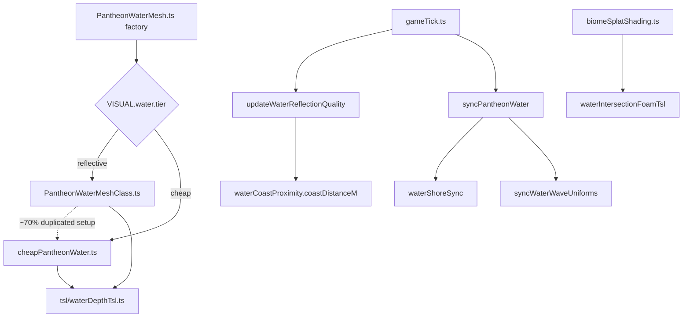

# World — Water Audit

Scope: `[src/world/water/](src/world/water/)` (25 files, ~1345 lines) — reflective + cheap water meshes, TSL shore/refraction/tide shaders, adaptive reflection quality, uniform sync. Audited via 3 explore subagents + direct file verification.

**Goal:** Leaner, more performant code — minimize new helpers; prefer inlining, dedup, and fixing bugs over abstraction.

---

## Architecture (verified)




**Two tiers, not three:** `PantheonWaterMesh.ts` is the factory; classes live in `PantheonWaterMeshClass.ts` (reflective) and `cheapPantheonWater.ts` (cheap). Editor uses a flat `MeshBasicMaterial` preview in `MapTerrainBuilder.ts` (out of scope).

---

## Plan verification (corrections from code review)


| Original claim                                        | Verdict         | Correction                                                                                                                                                                       |
| ----------------------------------------------------- | --------------- | -------------------------------------------------------------------------------------------------------------------------------------------------------------------------------- |
| `waterDepthBelowSurface` recomputed 4–5×/fragment     | **Confirmed**   | `[waterDepthTsl.ts](src/world/water/tsl/waterDepthTsl.ts)` — separate calls in opacity, scatter, refraction mask, beer-lambert, discard                                          |
| Reflector `resolutionScale` stuck at build-time value | **Confirmed**   | `[PantheonWaterMeshClass.ts:179,223](src/world/water/PantheonWaterMeshClass.ts)` assigns inside `Fn()` at material build; `updateWaterReflectionQuality` only updates mesh field |
| Foam `smoothstep` reversed edges                      | **Confirmed**   | `[waterIntersectionFoamTsl.ts:52-56](src/world/water/tsl/waterIntersectionFoamTsl.ts)` — **both** inner and outer bands                                                          |
| Remove `WATER_PARAMS.distortionScale` entirely        | **Wrong**       | Still used by `WATER_DAY.distortionScale` (`[waterConfig.ts:28](src/world/water/waterConfig.ts)`). Dedup vs `VISUAL.water.distortionDay`, don't delete blindly                   |
| `waterCurrentHeightTsl` dead                          | **Confirmed**   | No external importers                                                                                                                                                            |
| `WATER_DEV_DEFAULTS` unused                           | **Partial**     | Used by `resetWaterDev` internally; only **export** is unused externally                                                                                                         |
| Sun direction uses position−target                    | **Not a bug**   | `[syncPantheonWater.ts](src/world/water/syncPantheonWater.ts)` uses `sunDirectionFromSpherical`                                                                                  |
| TSL `Fn` object-return bug                            | **Not present** | Water uses single-value returns or side-effect `Discard` only                                                                                                                    |


---

## Phase A — Bugs & dead code (low risk)

Safe first batch; no shader graph restructuring.


| Task   | What                                                                                                                                                                                                             |
| ------ | ---------------------------------------------------------------------------------------------------------------------------------------------------------------------------------------------------------------- |
| **A1** | Fix reversed `smoothstep` on **inner + outer** foam bands in `[waterIntersectionFoamTsl.ts](src/world/water/tsl/waterIntersectionFoamTsl.ts)` (swap to `height−edge` → `height+edge`)                            |
| **A2** | Remove `waterCurrentHeightTsl` export; un-export `waterCoastLandMaskTsl` and `waterRefractedSceneColorTsl`                                                                                                       |
| **A3** | Dedup `WATER_PARAMS.distortionScale` → point `WATER_DAY` at `VISUAL.water.distortionDay`; fix stale comment at `[visualTuning.ts:386](src/config/visualTuning.ts)`                                               |
| **A4** | Add `resetWaterReflectionQualityState()` in `[updateWaterReflectionQuality.ts](src/world/water/updateWaterReflectionQuality.ts)`; call from `[disposePantheonWater.ts](src/world/water/disposePantheonWater.ts)` |
| **A5** | Gate `[waterDevDefaults.ts](src/world/water/waterDevDefaults.ts)` behind `import.meta.env.DEV`                                                                                                                   |


**Verify:** Foam stripe at waterline after A1.

---

## Phase B — GPU perf: share shore depth


| Task   | What                                                                                                                                                                                                                                                                                                                                        |
| ------ | ------------------------------------------------------------------------------------------------------------------------------------------------------------------------------------------------------------------------------------------------------------------------------------------------------------------------------------------- |
| **B1** | Export `waterDepthBelowSurface`; add optional `depth?: Node` to `waterDepthOpacityTsl`, `waterDepthScatterTintTsl`, `waterRefractionMaskTsl`, `waterBeerLambertAbsorptionTsl`, and `applyWaterRefractionTsl`. Mesh constructors compute depth once from `positionWorld.xz` and thread through. **No `Fn` object returns** (terrain lesson). |


**Verify:** Shore opacity, refraction murk, shallow tint, dry-land discard unchanged.

**GitNexus:** `impact` on `waterDepthOpacityTsl`, `waterRefractionMaskTsl`, `applyWaterRefractionTsl` before edit.

---

## Phase C — Reflector adaptive quality


| Task   | What                                                                                                                                                     |
| ------ | -------------------------------------------------------------------------------------------------------------------------------------------------------- |
| **C1** | Store reflector on mesh at construction (outside `Fn()`); `add(target)` once; `updateWaterReflectionQuality` writes `reflector.resolutionScale` directly |
| **C2** | Remove dead `uReflectorWeight` (always 1); simplify `reflectionMix` to `max(reflectance, VISUAL.water.minReflectionMix)`                                 |


**Verify:** DEV resolution slider + inland vs coast camera pitch actually changes reflector RT.

**Note:** C1 pairs naturally with D1 — can implement together when extracting shared setup.

---

## Phase D — Mesh-class dedup (user-approved)


| Task   | What                                                                                                                       |
| ------ | -------------------------------------------------------------------------------------------------------------------------- |
| **D1** | New `[buildWaterMeshGraph.ts](src/world/water/buildWaterMeshGraph.ts)` — JS-level shared setup (uniforms, getNoise with `2 |


**Verify:** Both `VISUAL.water.tier` values — shore, refraction, shadows, edge fade.

---

## Phase E — Hygiene: small dedup + TypeScript (do last)


| Task   | What                                                                                                                                                                                                                                                               |
| ------ | ------------------------------------------------------------------------------------------------------------------------------------------------------------------------------------------------------------------------------------------------------------------ |
| **E1** | Dedup `waterVertexWorldXZTsl` with terrain `macroSurfaceWorldXZ` — single canonical export                                                                                                                                                                         |
| **E2** | One fog-bypass uniform: keep `waterWaveUniforms.uShoreFogBypass`; remove `shore.uFogBypassStrength` + dual sync write                                                                                                                                              |
| **E3** | Fix tsc: `[waterShoreSync.ts:33](src/world/water/waterShoreSync.ts)`, `[devPanelWater.ts:25,33](src/ui/dev/devPanelWater.ts)`, `[main.ts:336](src/main.ts)`. Remove `@ts-nocheck` from 9 water files (terrain F3 pattern: `type TslNode = any`, `uniforms as any`) |


`**@ts-nocheck` files:** `waterTideTsl`, `waterDepthTsl`, `waterRefractionTsl`, `waterFogBypassTsl`, `waterIntersectionFoamTsl`, `waterEdgeFadeTsl`, `PantheonWaterNodeMaterial`, `PantheonWaterMeshClass`, `cheapPantheonWater`.

---

## Execution order


| Order | Phase | Tasks                        |
| ----- | ----- | ---------------------------- |
| 1     | **A** | A1–A5                        |
| 2     | **B** | B1                           |
| 3     | **C** | C1, C2 (can fold C1 into D1) |
| 4     | **D** | D1                           |
| 5     | **E** | E1, E2, E3                   |


---

## Verification (each batch)

```bash
npx tsc --noEmit
npx biome check --write <changed files>
npm run build
```

Full page reload after B, C, D. Do **not** run `npm run dev`.

---

## Out of scope

- Editor water preview (`MeshBasicMaterial` disc)
- `waterCoastProximity` CPU probe optimization (unless profiling shows CPU bound)
- Factory rename (`PantheonWaterMesh.ts` vs `PantheonWaterMeshClass.ts`)

---

## Progress: 12/12 tasks (Phases A–E complete)

